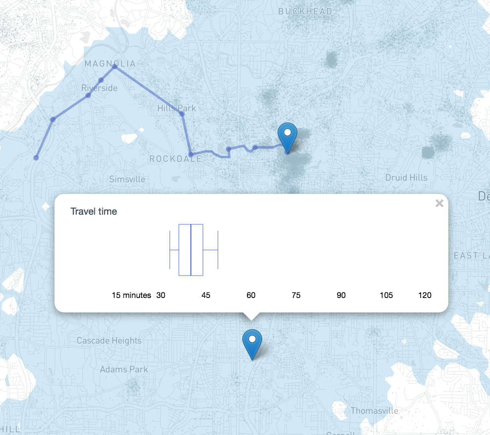
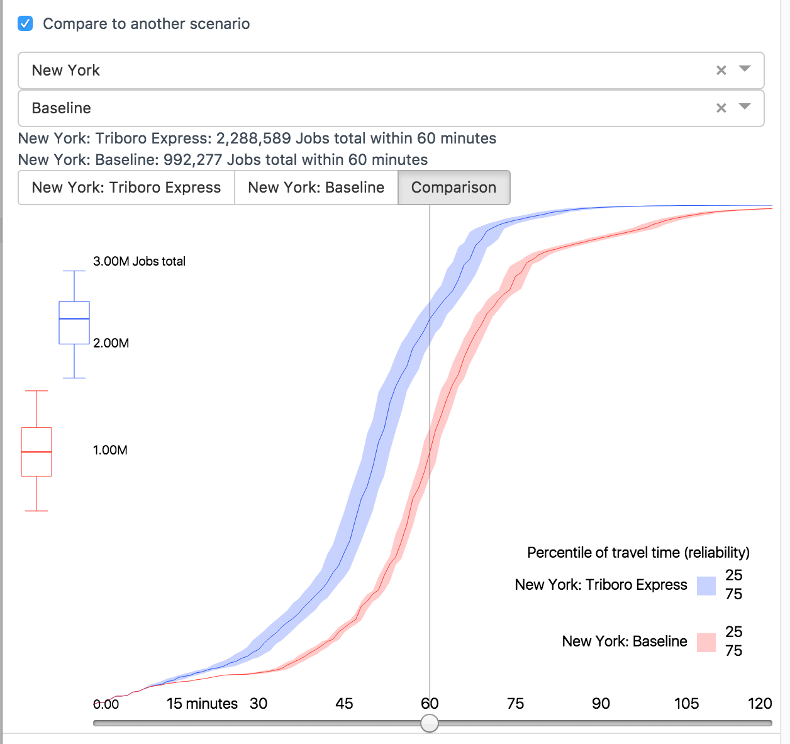
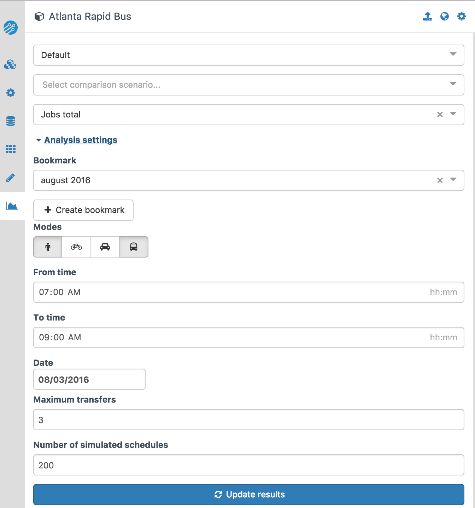
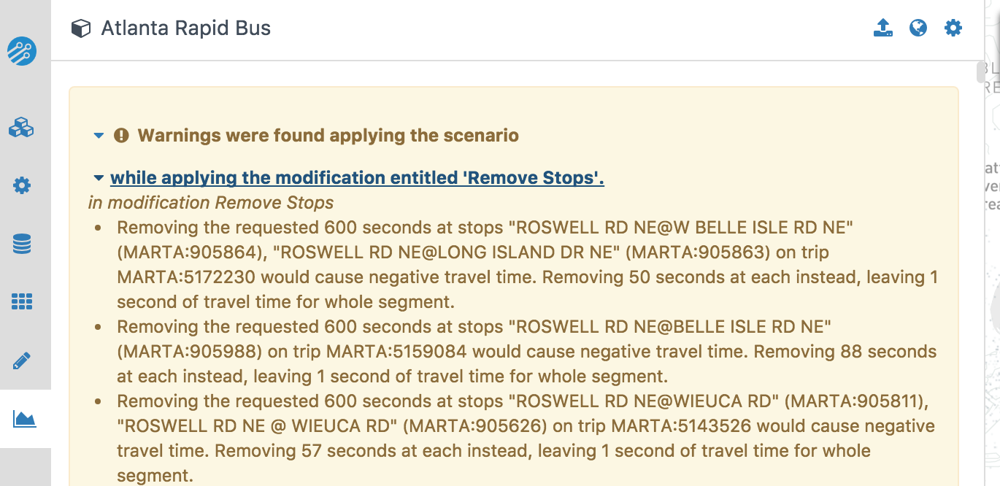

# Overview of analysis mode

The main analysis page is for generating isochrones (travel time contours) from selected origins.  To enter analysis mode, click this icon on the sidebar:  <i class="fa fa-area-chart"></i>Analyze

To start an analysis, ensure a project and scenario are selected.  Results corresponding to this scenario will be shown in blue.  You may also select a comparison project and scenario, which will be shown in red.  Then click:
 <i class="fa fa-refresh"></i> Fetch results

Once a compute cluster has initialized (which may take several minutes the first time you use a GTFS bundle), several components will be visible in the analysis mode.

## Isochrone map

After the server computes and returns results, the map will show a blue isochrone, which represents the area reachable within a given travel time (the default is 60 minutes, and it is controlled by the slider in the left panel) from the origin marker. To change the origin of the analysis, simply drag the marker to a new location.

The modifications displayed on the map can be controlled in [editing mode](../edit-scenario/index.html#toggling-display-of-modifications-on-the-map).

If an [opportunity dataset](../prepare-inputs/upload-opportunity-data.html) is selected in the drop-down menu in the settings panel, the map will show gray dots representing the density of opportunities. For instance, if your selected opportunity data are jobs, there will be tightly packed dots in areas of dense employment, and less tightly packed dots elsewhere. One dot represents one or multiple opportunities, and the scale may differ between zoom levels and opportunity datasets. For example, if at a given zoom level, one dot represents 4 jobs, at that same zoom level one dot might represent only two residents.

If multiple scenarios are being compared, the isochrone for the first scenario remains blue, while the isochrone for the second is red. Thus, areas reachable under both scenarios are purple, areas reachable only under the first scenario are blue, and areas reachable only under the second scenario are red.

Clicking on the map will display the distribution of travel times from the origin to that location. For example, in the image below, the travel time varies between about 30 and 50 minutes depending on when one leaves.

<figure>
  
  <figcaption>The travel time distribution from an origin to a destination</figcaption>
</figure>

## Analysis panel
The left panel has controls for the analysis and displays the accessibility afforded by the scenario.

At the top of the panel, available scenarios and opportunity data layers are listed in drop-down menus. For example, you might be interested in how a given scenario provides access to jobs, or access to schools, or some other variable of interest represented in an Opportunity Dataset you uploaded.

Additional scenarios can be selected for comparison. A "Baseline" scenario with no modifications (i.e. the unmodified GTFS bundle you uploaded) is automatically available for every project.

### Charts of accessibility results
Directly below the comparison controls are readouts of the accessibility (number of opportunities reachable) from the chosen origin under the scenario and (if applicable) any comparison scenario.

<figure>
  
  <figcaption>A stacked percentile plot</figcaption>
</figure>

The main display of accessibility results is the stacked percentile plot. The right portion of the plot shows the distribution of cumulative accessibility, i.e. the number of opportunities reachable given varying travel time cutoffs. The graph is not a single line, because there is variation in transit travel time depending on when a user of the transport system leaves their origin. Rather, the graph shows the number of opportunities given 95th, 75th, 50th, 25th, and 5th percentile travel time. The bottom of the shaded area is the number of opportunities which are almost always reachable, while the top is the number of opportunities that are reachable only in the best cases (e.g. when someone leaves their house at the perfect time and has no waiting time). The darkened line is the number of opportunities that are reachable at least half the time (i.e. have a median travel   time of less than the travel time cutoff). For a more detailed explanation, see the [methodology](methodology.html) page.

The currently-selected travel time cutoff is indicated by the vertical line on the plot, and can be controlled using the slider below the plot. This also controls the isochrone on the map.

To the left of the Y axis labels is a box-and-whisker plot. This shows the same information as the cumulative plot, but only for the currently selected travel time cutoff. The lowest whisker shows the number of opportunities accessible given 95th percentile travel time, the box shows the number of opportunities accessible given 75th, 50th and 25th percentile travel time, and the top whisker shows the number of opportunities reachable given 5th percentile travel time.

When multiple scenarios are selected, the charts will be slightly different, because they will include information for both scenarios.

<figure>
  
  <figcaption>Comparison analysis in Atlanta, Georgia, USA</figcaption>
</figure>

Two box plots will be displayed, in red and blue, to the left of the axis. The blue box plot is for the first scenario, while the red one is for the second scenario. Above the chart, there is a selector that allows you to select whether to view the cumulative curves for the first scenario, the second scenario, or both (in which case the plots will be simplified and only the bands between the 75th and 25th percentile travel times will be shown, for simplicity).

<figure>
  
  <figcaption>A stacked percentile plot comparing two scenarios</figcaption>
</figure>

There are multiple options for downloading single-point analyses for use in GIS software:

* <i class="fa fa-download"></i> Isochrone as GeoJSON saves the isochrone currently shown on the map.  The downloaded file can be converted to other formats using a tool like [mapshaper](http://mapshaper.org).
* <i class="fa fa-globe"></i> Generate & Download GeoTIFFs saves the underlying travel time surface, a raster of travel times (in minutes) from the selected origin to the rest of the region.  This raster has five bands corresponding to [time percentiles](methodology.html#time-percentile) of 5, 25, 50, 75, and 95.

### Analysis options
Below the accessibility charts, different parameters for the analysis can be set:

<figure>
  
  <figcaption>The analysis settings pane</figcaption>
</figure>

The first panel allows the creation and use of **bookmarks**, which store particular analysis settings (e.g. origin location, type of opportunity, departure date and time, travel time cutoff, etc.). Once you have a set of settings you would like save, click <i class="fa fa-plus"></i> Create bookmark. Once that is done, you can select a bookmark from the dropdown box to automatically fill in all of the settings from that bookmark. Bookmarks are shared by all projects in a region.

Next are selectors for **access modes** and **transit modes**; you can choose to perform your analysis with or without transit, and using walking, biking or driving. For instance, in the image above, a combination of walking and transit has been chosen. Note that traffic congestion is not taken into account in driving time estimates, though this may be a feature of a future release when more detailed datasets are available.

Next are the **date**, **from time**, and **to time**, which define the time period analyzed. These default to 7:00 and 9:00, meaning our accessibility results will display the opportunities accessible by someone leaving the chosen origin point on the chosen day between 7:00 and 9:00. To avoid inadvertently introducing differences in results due to differences in service on different days, we recommend choosing a single date and using it for the duration of a project. You should check that the date chosen is sufficiently representative in the GTFS feeds you are using (e.g. a non-holiday weekday).

You will also need to select a **Routing engine** version, which should default to the highest available version of [Conveyal R5](https://github.com/conveyal/r5).

The final option is the **Percentile of travel time**.  In single-point analyses, this is rounded to one of five pre-defined values (5, 25, 50, 75, and 95).  For more information, see [methodology](methodology.html#time-percentile).

### Detailed settings

**Maximum transfers** is an upper limit on the number of transfers that will be considered when finding optimal trips.  

When your GTFS feeds or scenarios include frequency-based routes (i.e. routes that do not have timetables with exact times specified), **simulated schedules**  controls the number of schedules simulated for sampling. Final results will be more accurate when it is set higher, but computation may take longer. For quick, interactive analysis, we recommend setting it to 200, whereas, for final analysis, we recommend setting it to 1000. For more information, see [methodology](methodology.html).

### Errors and warnings

Occasionally, analysis will fail because there is an error in a scenario. When this occurs, error messages will be displayed detailing the issues, as shown below. One simply needs to return to the modification editor and correct the errors in the relevant modifications.

In other cases, the scenario may generate a warning, for instance if you remove more time from a segment when speeding it up than the length of that segment. This is not necessarily an error, but may require attention.

<figure>
  
  <figcaption>Scenario warnings displayed in the editor</figcaption>
</figure>

### Starting a regional analysis
The analysis interface also allows starting Regional Analyses, which involves repeating an accessibility calculation for every location in a regular grid. To start a regional analysis, first set the appropriate parameters using the controls in this view, and confirm that the isochrones and accessibility plots are as expected.

You can also choose geographic bounds for your regional analysis in the Advanced settings. By default, the entire region is analyzed, but for efficiency it is also possible to analyze a smaller area. You can set the bounds of the analysis by dragging the pins on the map, or by selecting an existing regional analysis and using the same bounds. If you plan to compare two regional analyses, make sure they have the same bounds.

When you have configured all of these options, click <i class="fa fa-plus"></i> New regional analysis at the top of the panel and enter a name.

After a few seconds, you will see your regional analysis appear in the list with a progress bar. Since we are computing the accessibility for every origin in the city, it can take a significant amount of time for all of the number-crunching to occur. Once a regional analysis is complete, it can be viewed by selecting it from the drop-down menu, which will take you to the [regional analysis view](regional.html).

<figure>
  
</figure>
