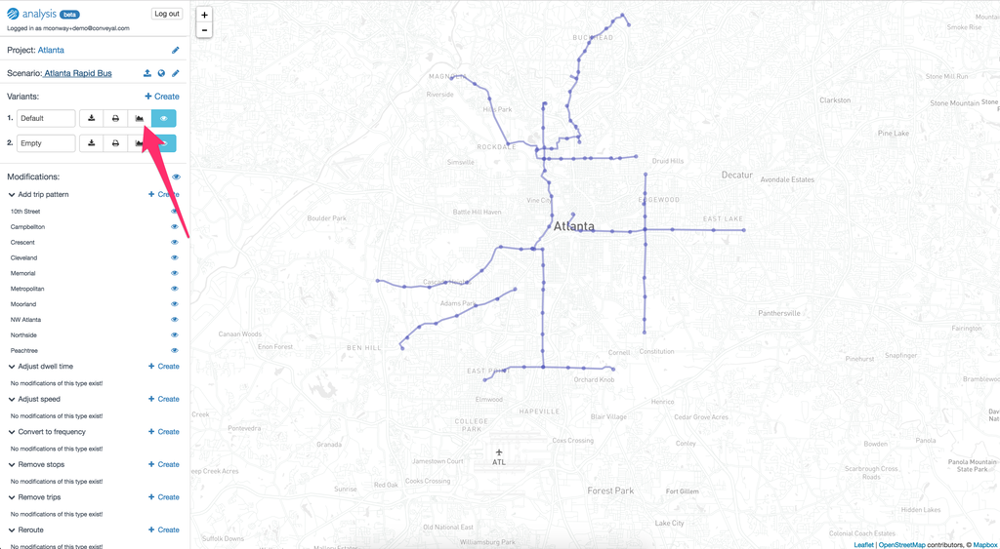
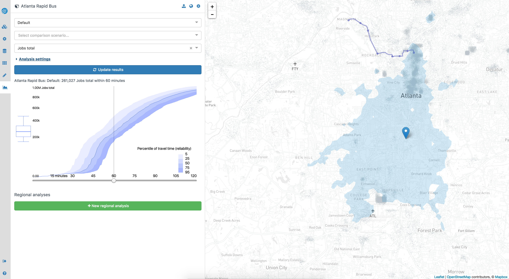
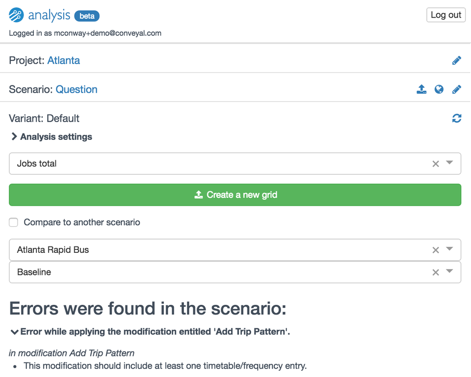
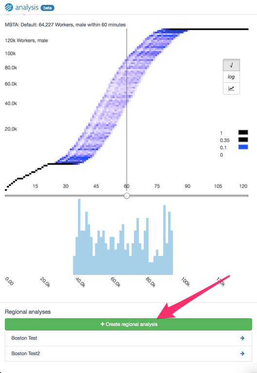

Once you have prepared a scenario, you can use the analysis functionality to evaluate the accessibility
impacts of your scenario. To enter the analysis mode, click on the graph button in the sidebar.

If your project is in the United States, you should shortly see an isochrone and several accessibility plots.
If your project is outside the US, or if you want to compute accessibility using a land use dataset other than the
US Census [LODES](https://lehd.ces.census.gov/data/#lodes), you'll need to [upload opportunity data](upload-opportunity-data) (e.g. job locations) in order
to complete analysis.

Once you have opportunity data loaded, you will see the following when you enter analysis mode. It will take several minutes to load
the first time you use it, while the compute cluster starts up. The spinner to the right of the
variant name will indicate that the cluster is initializing.

<figure>
  
  <figcaption>The initial analysis page</figcaption>
</figure>

The UI consists of several components. On the right is a map display consisting of several components.
The gray dots represent the density of opportunities. For instance, if you're analyzing access to jobs,
there will be tightly packed dots in areas of dense employment, and less tightly packed dots elsewhere.
One dot represents one or multiple opportunities (e.g. jobs), and the scale may differ between zoom
levels and opportunity datasets. For example, if at a given zoom level, one dot represents 4 jobs, at that
same zoom level one dot might represent only two residents.

The map also shows an isochrone (the area shaded in blue), which represents the area of the city that
can be reached from the marker location within a given travel time (the default is 60 minutes, and it
is controlled by the slider in the left panel.) To change the origin of the analysis, simply drag the marker
to a new location.

Clicking on the map will display the distribution of travel times from the origin to that location.
For example, in the image below, the travel time varies between about 30 and 50 minutes depending on
when one leaves.

<figure>
  
  <figcaption>The travel time distribution from an origin to a destination</figcaption>
</figure>

# Routing controls

The left panel has a number of controls for the analysis, and displays the accessibility afforded by the
scenario. At the top of the panel, the variant of the scenario is listed, and can be changed to
analyze a different variant. Below that, a second scenario and a variant within that scenario may be selected
in order to perform a comparison. A comparison with baseline GTFS data with no modifications applied
is possible by choosing the current scenario and the "Baseline" variant, which exists automatically
for every scenario.

Below that, the analysis settings can be expanded and different parameters for the analysis can be set:

<figure>
  
  <figcaption>The analysis settings pane</figcaption>
</figure>

Here you can set a number of parameters. The first panel allows the creation and use of "bookmarks,"
which store particular analysis settings (e.g. origin location, type of opportunity, departure date
and time, travel time cutoff, etc.). Once you have a set of settings you would like save, you can choose
"Create Bookmark," enter a name for the bookmark, and click "Create Bookmark" again to save it. Once that is
done, you can select a bookmark from the dropdown box to automatically fill in all of the settings from
that bookmark. Bookmarks are shared by all scenarios in a project; this way, the same locations and
settings can be used to analyze the effects of multiple scenarios.

Next is the mode selector; you can choose to perform your analysis with or without transit, and using
walking, biking or driving. For instance, in the image above, a combination of walking and transit has
been chosen. Note that, due to data availability, traffic congestion is not taken into account in
driving time estimates.

Next are the from and to time; these represent the time period
you are analyzing. These default to 7:00 and 9:00, meaning our accessibility results will display
the opportunities accessible by someone leaving the chosen origin point between 7:00 and 9:00. Below
that is the date of the analysis. This date determines what service will be included in the analysis.
To avoid inadvertently introducing differences in results due to differences in service on different
days, we recommend choosing a single date and using it for the duration of a project. This date should,
of course, be within the validity period of the baseline GTFS feed you are using.

Below that is the transfer limit. This specifies the number of transfers that will be considered to
find the optimal trip.

The next field is the number of simulated schedules. When there are lines that have headways rather
than full schedules, this controls the number of random schedules that are generated. Results will be
more accurate when it is set higher, at the cost of speed. For quick, interactive analysis, we
recommend setting it to 200, whereas, for final analysis, we recommend setting it to 1000. For more on this,
see [methodology](/analysis/methodology).

Below the analysis settings pane is a dropdown to choose a category of opportunities to measure accessibility to.
For example, you might be interested in access to jobs, or access to schools, or some other variable of
interest. In the US, these categories will be automatically populated from the US Census [LODES](https://lehd.ces.census.gov/data/#lodes)
dataset. If you are outside the US, or if you want to use data that isn't included in LODES, you can
[upload alternate data](/analysis/upload-opportunity-data). The opportunities from the selected category
will be displayed on the map as dots.

The last item in the analysis settings area is a refresh button, used to reload scenario results after editing parameters.

# Accessibility display

Below the analysis controls are the displays of accessibility. The main component is the stacked
percentile plot, described in the next section. Additionally, directly below the comparison controls
are readouts of the accessibility (number of opportunities reachable) from the chosen origin under the scenario and
(if applicable) any comparison scenario.

## Stacked percentiles

<figure>
  
  <figcaption>A stacked percentile plot</figcaption>
</figure>

The main display of accessibility results is the stacked percentile plot. The right portion of the plot
shows the distribution of cumulative accessibility, i.e. the number of opportunities reachable given
varying travel time budgets. The graph is not a single line, because there is variation in transit travel
time depending on when a user of the transport system leaves their origin.
Rather, the graph shows the number of opportunities given 95th, 75th, 50th, 25th, and 5th percentile
travel time. The bottom of the shaded area is the number of opportunities which are almost always
reachable, while the top is the number of opportunities that are occasionally reachable. The darkened
line is the number of opportunities that are reachable at least half the time (i.e. have a median travel
  time of less than the travel time cutoff). For a more detailed explanation, see the [methodology](/analysis/methodology)
  page.

The currently-selected travel time budget is indicated by the vertical line on the plot, and can be controlled using
the slider below the plot. This also controls the isochrone.

To the left of the Y axis labels is a box-and-whisker plot. This shows the same information as the cumulative
plot, but only for the currently selected travel time budget. The lowest whisker shows the number of
opportunities accessible given 95th percentile travel time, the box shows the number of opportunities
accessible given 75th, 50th and 25th percentile travel time, and the top whisker shows the number of
opportunities reachable given 5th percentile travel time.

## Comparing scenarios

When a comparison scenario and variant are selected in the analysis settings panel, the display will
be slightly different, because it will include information for both scenarios. The isochrone for the
originally chosen scenario remains blue, while the isochrone
for the comparison scenario is red. Thus, the areas reachable under both scenarios are purple, the areas reachable under the originally chosen
scenario are blue, and the areas reachable only under the comparison scenario are red.

<figure>
  
  <figcaption>Comparison analysis in Atlanta, Georgia, USA</figcaption>
</figure>

The stacked percentile plot is similar as well. The main difference is that two box plots will be
displayed, in red and blue, to the left of the axis. The blue box plot is for the scenario currently
being analyzed, while the red one is for the scenario being compared against. Above the chart, there
is a selector that allows you to select whether to view the cumulative curves for the scenario being
analyzed, the scenario being compared against, or both (in which case the plots will be simplified and
  only the bands between the 75th and 25th percentile travel times will be shown, for visual simplicity).

<figure>
  
  <figcaption>A stacked percentile plot comparing two scenarios</figcaption>
</figure>

# Errors and warnings when analyzing scenarios

Occasionally, analysis will fail because there is an error in a scenario. When this occurs, error
messages will be displayed detailing the issues, as shown below. One simply needs to return to the modification editor
and correct the errors in the relevant modifications.

<figure>
  
  <figcaption>Scenario errors displayed in the editor</figcaption>
</figure>

In other cases, the scenario may generate a warning, for instance if you remove more time from a segment
when speeding it up than the length of that segment. This is not necessarily an error, but may require attention.

<figure>
  
  <figcaption>Scenario warnings displayed in the editor</figcaption>
</figure>

# Starting a regional analysis

The analysis interface also allows starting regional analyses, which involves computing the accessibility
for every location in a regular grid across the region. To start a regional analysis, first set the
appropriate parameters using the controls in this view, and confirm that the isochrones and accessibility
plots are as expected. When you are ready, choose the "Create regional analysis" button. You can then
enter a name for your regional analysis, and choose the bounds you want to use; by default, the entire
project area is analyzed, but for efficiency it is also possible to analyze a smaller area. You can set
the bounds of the analysis by dragging the pins on the map, or by selecting an existing regional analysis
and using the same bounds. If you plan to compare two regional analyses, they must have the same bounds.
Finally, there is a slider where you can select the percentile of travel time you wish to use for this
analysis (for example, you might be analyzing accessibility to a class of employment that generally requires
  workers to arrive at a particular time, and workers thus need a reliable trip where they have a
  very high probability of arriving within the travel time budget, regardless of the exact timing of
  their departure/arrival).

<figure>
  
  <figcaption>Creating a regional analysis</figcaption>
</figure>

After a few seconds, you will see your regional analysis appear in the list with a progress bar. Since
we are computing the accessibility for every origin in the city, it can take a significant amount of time
for all of the number-crunching to occur.

<figure>
  
  <figcaption>Displaying the progress of a regional analysis</figcaption>
</figure>

Once a regional analysis is complete, it can be viewed by clicking the right arrow next to its name,
which will take you to the [regional analysis view](/analysis/regional).
