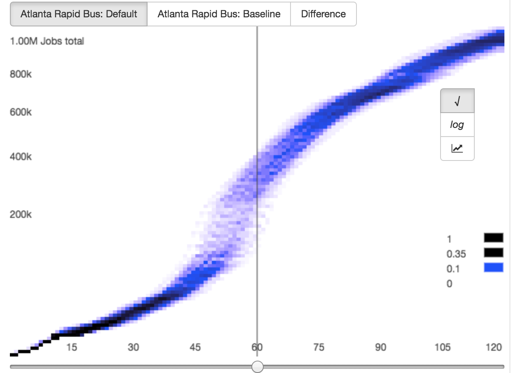
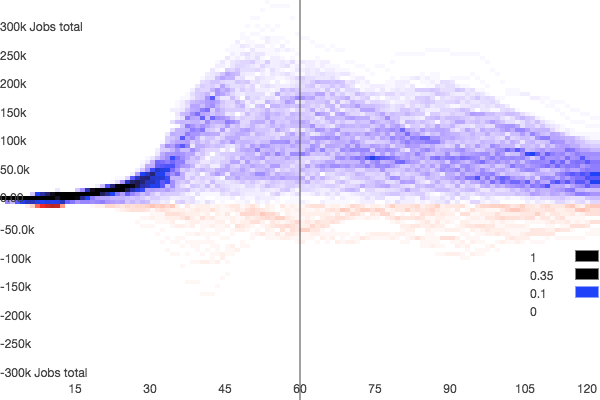
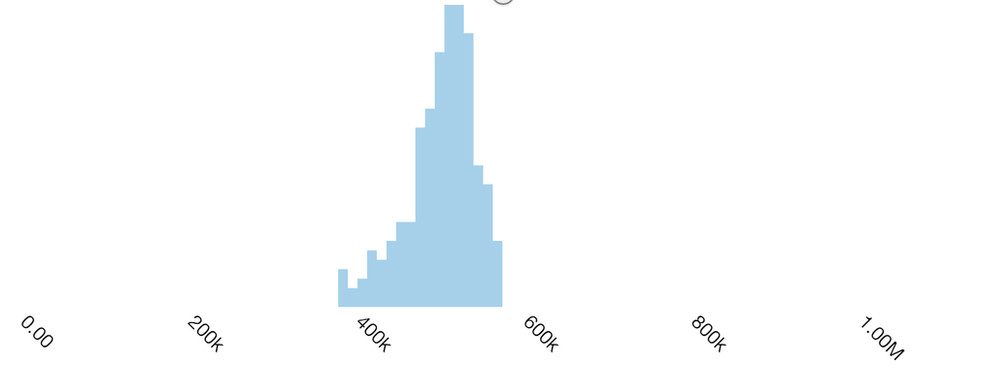
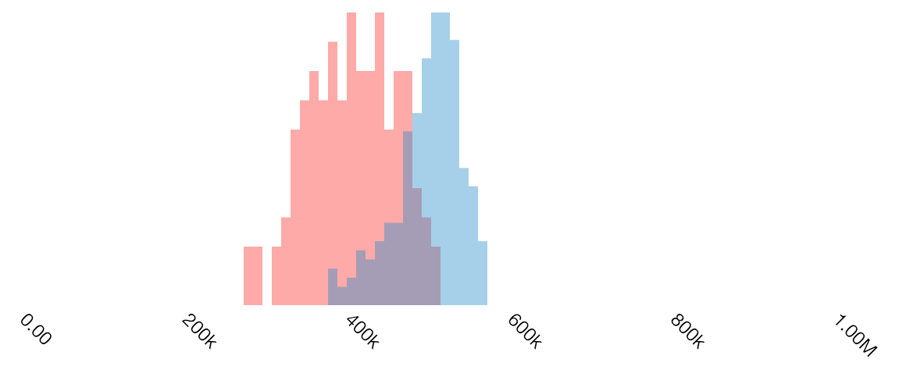

Once you have prepared a scenario, you can use the analysis functionality to evaluate the accessibility
impacts of your scenario. To enter the analysis mode, click on the graph button next to a variant name.
The analysis mode requires choosing a particular variant, which represents an exact subset of modifications
to analyze.

If your project is in the United States, you should shortly see an isochrone and several accessibility plots.
If your project is outside the US, or if you want to compute accessibility using a land use dataset other than the
US Census [LODES](https://lehd.ces.census.gov/data/#lodes), you'll need to [upload opportunity data](upload-opportunity-data) (e.g. job locations) in order
to complete analysis.

Once you have opportunity data loaded, you will see the following when you enter analysis mode. It will take several minutes to load
the first time you use it on a particular day while the compute cluster starts up. The spinner to the right of the
variant name will indicate that the cluster is initializing.

<figure>
  
  <figcaption>The initial analysis page</figcaption>
</figure>

The UI consists of several components. On the right is a map display consisting of several components.
The gray dots represent the density of opportunities. For instance, if you're analyzing access to jobs,
there will be tightly packed dots in areas of dense employment, and less tightly packed dots elsewhere.
One dot represents one or multiple opportunities (e.g. jobs), and the scale may differ between zoom
levels and opportunity datasets. For example, if at a given zoom level, one dot represents 4 jobs, at that
same zoom level one dot might represent only two residents.

The map also shows an isochrone (the area shaded in blue), which represents the area of the city that
can be reached from the marker location within a given travel time (the default is 60 minutes, and it
is controlled by the slider in the left panel.) To change the origin of the analysis, simply drag the marker
to a new location.

# Routing controls

The left panel has a number of controls for the analysis, and displays the accessibility afforded by the
scenario. At the top of the panel, the variant of the scenario is listed; to the right of that is a
refresh button, used to reload scenario results after editing parameters.

Below that, the analysis settings can be expanded and different parameters for the analysis can be set:

<figure>
  
  <figcaption>The analysis settings pane</figcaption>
</figure>

Here you can set a number of parameters. The first panel allows the creation and use of "bookmarks,"
which store particular analysis settings (e.g. origin location, type of opportunity, departure date
and time, travel time cutoff, etc.). Once you have a set of settings you would like save, you can choose
"Create Bookmark," enter a name for the bookmark, and click "Create Bookmark" again to save it. Once that is
done, you can select a bookmark from the dropdown box to automatically fill in all of the settings from
that bookmark. Bookmarks are shared by all scenarios in a project; this way, the same locations and
settings can be used to analyze the effects of multiple scenarios.

Next are the from and to time; these represent the time period
you are analyzing. These default to 7:00 and 9:00, meaning our accessibility results will display
the opportunities accessible by someone leaving the chosen origin point between 7:00 and 9:00. Below
that is the date of the analysis. This date determines what service will be included in the analysis.
To avoid inadvertently introducing differences in results due to differences in service on different
days, we recommend choosing a single date and using it for the duration of a project. This date should,
of course, be within the validity period of the baseline GTFS feed you are using.

Below that is the transfer limit. This specifies the number of transfers that will be considered to
find the optimal trip.

The next field is the number of simulated schedules. When there are lines that have headways rather
than full schedules, this controls the number of random schedules that are generated. Results will be
more accurate when it is set higher, at the cost of speed. For quick, interactive analysis, we
recommend setting it to 200, whereas, for final analysis, we recommend setting it to 1000. For more on this,
see [methodology](/analysis/methodology).

Below the analysis settings pane is a dropdown to choose a category of opportunities to measure accessibility to.
For example, you might be interested in access to jobs, or access to schools, or some other variable of
interest. In the US, these categories will be automatically populated from the US Census [LODES](https://lehd.ces.census.gov/data/#lodes)
dataset. If you are outside the US, or if you want to use data that isn't included in LODES, you can
[upload alternate data](/analysis/upload-opportunity-data). The opportunities from the selected category
will be displayed on the map as dots.

# Performing a comparison

Below the dropdown box is a checkbox which can be selected to perform a comparison between two scenarios.
When activated, two more dropdown boxes will appear allowing you to select a scenario and variant to
compare against. Each scenario will also show a "Baseline" variant allowing you to compare against the
bundle selected for that scenario with no modifications. To compare a scenario to the existing conditions
described by the bundle it is based upon, you would choose the scenario you are working with, and then
the baseline variant. Once you have enabled this checkbox and selected a scenario and variant, you can
view the comparison by clicking the "Refresh" icon near the top of the left sidebar.

<figure>
  
  <figcaption>Comparison analysis in Atlanta, Georgia, USA</figcaption>
</figure>

When performing a comparison, the isochrone for the originally chosen scenario remains blue, while the isochrone
for the comparison scenario is red. Thus, the areas reachable under both scenarios are purple, the areas reachable under the originally chosen
scenario are blue, and the areas reachable only under the comparison scenario is red.

# Accessibility display

Below the comparison controls are the displays of accessibility. These consist of two main components: the
spectrogram and the histogram. Additionally, directly below the comparison controls are readouts of the
average accessibility (number of jobs reachable) from the chosen origin under the scenario and
(if applicable) any comparison scenario.

## Spectrogram

<figure>
  
  <figcaption>A spectrogram</figcaption>
</figure>

The first plot is what we refer to as a "spectrogram." It is akin to a cumulative accessibility plot,
showing the number of opportunities that can be reached from each origin with different travel times.
Travel times from the origin are on the X axis, and the number of opportunities that can be accessed
is on the Y axis. There is not a single line showing the number of opportunities that can be accessed,
but rather a field. The number of opportunities accessible within a given travel time budget is not constant,
but varies due to differing amounts of waiting depending on departure time (within the specified time window),
and due to uncertainty introduced by routes that have only headways rather than complete schedules
(see [Methodology](/analysis/methodology)).

The width of the shaded area indicates the variability in the number of opportunities that can be accessed.
Where it is wide, the transit service is relatively unreliable; depending on when you leave the
origin and how well lines without schedules are ultimately synchronized with other lines, you may be
able to access many jobs, or not very many. If the shaded area is narrow, the transit service is reliable;
you can count on being able to access most jobs regardless of when you leave and how lines without schedules
are ultimately operated. The darkness of the shaded area represents the probability of experiencing
a particular accessibility given a particular travel time budget. The darkest blues and blacks indicate
a high probability of being able to reach a particular number of opportunities in a particular travel
time. The scale is in units of probability, so 1 (black) indicates that a particular accessibility
value will always be experienced, and 0 (white) indicates it never will be.

The vertical line across the spectrogram indicates the current travel time cutoff for the isochrone
on the map as well as the [histogram of accessibility](#histogram). The cutoff can be adjusted using
the slider below the spectrogram.

On the right side of the spectrogram is a selector that
allows you to change the scale on the Y-axis between square root, logarithmic, and linear. It defaults
to square root, for a simple geometric reason: if opportunities were evenly distributed, and travel speed
were constant, a square root scale would make the cumulative accessibility curve a straight line due
to growth in two dimensions.

If you are performing a comparison, several more options are available. Above the spectrogram is a selector
that allows you to toggle between the two scenarios, with the active scenario in blue, and the comparison scenario
in red. Both are on the same scale to facilitate comparisons. Additionally, you can view a spectrogram
of the differences:

<figure>
  
  <figcaption>A spectrogram of the difference between two scenarios</figcaption>
</figure>

The image shows the distribution of the differences between two scenarios. Blue indicates that
that the active scenario performs better, and red indicates that the comparison scenario performs better.
This is computed by subtracting the accessibility distribution of the comparison scenario from that of the
active scenario (for the mathematically minded, it is a convolution). Only in the most extreme scenarios will
one scenario be uniformly better than the other; for this to occur, the best possible user experience
(i.e. the maximum accessibility, realized through minimal waiting for transit vehicles at a particular time
  of departure within the specified time window) given one scenario must be worse than the worst possible user experience
experienced given the other. To put this more concretely, travel times must be faster under one scenario
when you arrive at the station just as the transit vehicle is leaving than they are if you arrive at the station
just as the transit vehicle is arriving under the other scenario. The difference spectrogram is often
easiest to interpret with the linear scale selected.

For more on the spectrogram visualization, you can read our
[blog post introducing it](https://blog.conveyal.com/exploring-and-visualizing-variation-in-accessibility-measures-5247aa49043c).

## Histogram

Below the spectrogram is a histogram. This histogram shows the distribution of accessibility values
for the currently selected travel time cutoff. It is effectively a vertical "slice" through the spectrogram.
For instance, the histogram below shows that there are between 380,000 and 580,000 jobs accessible
within 60 minutes, depending on when exactly you leave during the time window and how lines without schedules
are ultimately operated, and it is most likely that 500,000 jobs will be accessible.

<figure>
  
  <figcaption>A histogram of the job access</figcaption>
</figure>

When comparing two scenarios, histograms from both scenarios will be displayed in an overlapping fashion.
Just as on the map, the active scenario will be shown in blue, and the comparison scenario in red.

<figure>
  
  <figcaption>A histogram comparing two scenarios</figcaption>
</figure>

# Errors when analyzing scenarios

Occasionally, analysis will fail because there is an error in a scenario. When this occurs, error
messages will be displayed detailing the issues, as shown below. One simply needs to return to the modification editor
and correct the errors in the relevant modifications.

<figure>
  
  <figcaption>Scenario errors displayed in the editor</figcaption>
</figure>

# Starting a regional analysis

The analysis interface also allows starting regional analyses, which involves computing the accessibility
for every location in a regular grid across the region. To start a regional analysis, first set the
appropriate parameters using the controls in this view, and confirm that the isochrones and accessibility
plots are as expected. When you are ready, choose the "Create regional analysis" button, enter a name
for your regional analysis in the box that appears, and click the checkmark to confirm and start the
analysis.

<figure>
  
  <figcaption>Creating a regional analysis</figcaption>
</figure>

After a few seconds, you will see your regional analysis appear in the list with a progress bar. Since
we are computing the accessibility for every origin in the city, it can take a significant amount of time
for all of the number-crunching to occur.

<figure>
  
  <figcaption>Displaying the progress of a regional analysis</figcaption>
</figure>

Once a regional analysis is complete, it can be viewed by clicking the right arrow next to its name,
which will take you to the [regional analysis view](/analysis/regional).
