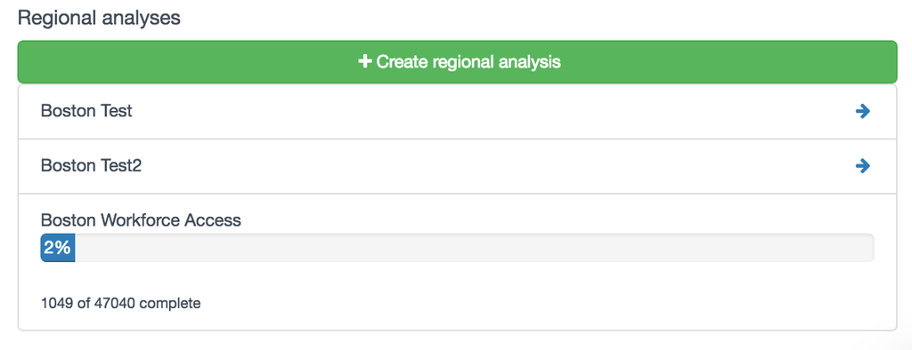
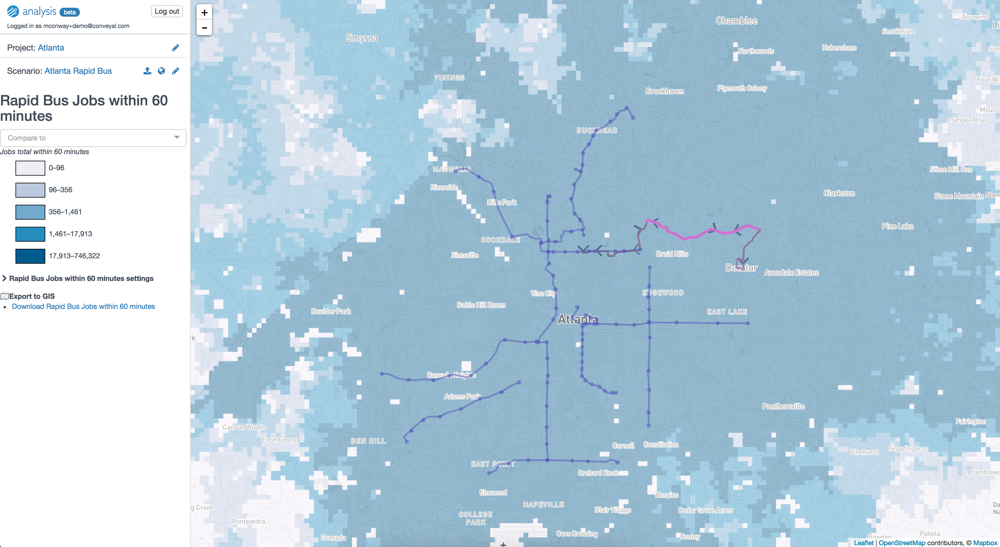
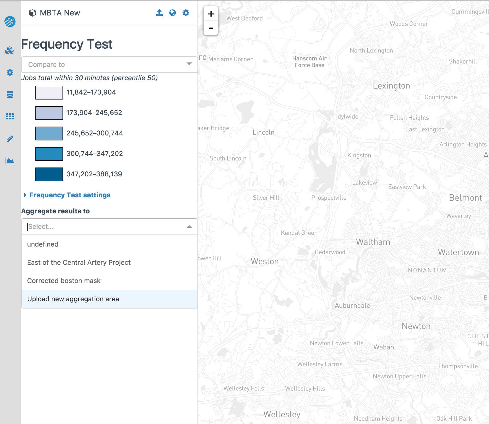
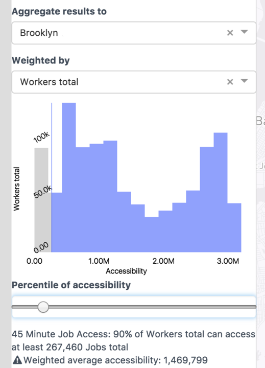

.. _regional_analysis:
# Regional analysis

The :ref:`single_point_analysis` interface also allows creating a *regional analysis*, which involves repeating an accessibility calculation for every location in a regular grid (See :ref:`spatial_grid`).

## Starting a regional analysis

To start a regional analysis, first set the appropriate parameters using the controls for a :ref:`single_point_analysis`, and confirm that the :term:`isochrones<isochrone>` and accessibility plots are as expected.

You can also choose geographic bounds for your regional analysis in the Advanced settings. By default, the entire region is analyzed, but for efficiency it is also possible to analyze a smaller area. You can set the bounds of the analysis by dragging the pins on the map, or by selecting an existing regional analysis and using the same bounds. If you plan to compare two regional analyses, make sure they have the same bounds and routing engine version.

When you have configured all of these options, click <i class="fa fa-plus"></i> New regional analysis at the top of the panel and enter a name. Note that this button is disabled unless isochrones are displayed; checking single-origin isochrone results is a verification step that helps avoid heavy computation for analyses with invalid settings.

After a few seconds, you will see your regional analysis appear in the list with a progress bar. Since Conveyal Analysis is computing accessibility from every origin in the region, it can take a [few minutes](../learn-more/faq.html#how-long-should-each-regional-analysis-take) for each regional analysis to complete.

<figure>
  
    <figcaption>Computing status for a running regional analysis</figcaption>
</figure>

Once a regional analysis is complete, it can be viewed by selecting it from the drop-down menu, which will take you to the [regional analysis view](regional.html).

<figure>
  
    <figcaption>Selecting a completed regional analysis from the drop-down menu</figcaption>
</figure>

## Inspecting results
Upon selecting a completed regional analysis, you will see a screen like the following:

<figure>
  
  <figcaption>Viewing a regional analysis</figcaption>
</figure>

The map shows the number of opportunities reachable from each location within the travel time cutoff specified when creating the regional analysis. Using the download button, you can save regional analysis results in a [GeoTIFF](https://en.wikipedia.org/wiki/GeoTIFF) raster format. These files can then be opened in a GIS to conduct additional analyses or create custom maps. Downloading results also allows you to see the raw [grid cells](methodology.html#spatial-resolution) used for analysis, rather than the smoother interpolated results shown in your browser.

## Downloading regional results

Using the download button, you can save regional analysis results in a raster format (GEOTIFF). These saved files can be opened in GIS to conduct additional analyses or create custom maps. In QGIS, you will likely want to [style](https://docs.qgis.org/2.8/en/docs/training_manual/rasters/changing_symbology.html#basic-fa-changing-raster-layer-symbology) the accessibility layer with a singleband pseudocolor scheme. If you prefer to work with the results as a regular grid of vector points, you may find the "Raster values to points" tool in the QGIS processing toolbox helpful. Downloading results also allows you to see the raw [grid cells](methodology.html#spatial-resolution) used for analysis, rather than the smoother interpolated results shown in your browser.

## Comparing regional analyses

You can also compare two regional analyses from different projects in the same region. The map will show the differences in accessibility between the two analyses, with blue areas showing increased accessibility, and red areas showing decreased accessibility, relative to the comparison analysis. Again, you can download raw results for the two analyses being compared for further styling and analysis in GIS.

## Measuring aggregate accessibility

These regional analyses present a wealth of information, and maps of regional accessibility are frequently the best way to communicate the accessibility impacts of a transit plan. However, in some cases there is a need to summarize accessibility in a single aggregate metric. Conveyal Analysis allows aggregating the results of a regional analysis to _aggregation areas_ (e.g. neighborhood, city council district, transit agency service area, or region). For a selected aggregation area, Conveyal Analysis can report the distribution of accessibility in that area, weighted by a value (e.g. population or households) at each grid cell origin.

### Uploading aggregation areas

In order to accomplish this aggregation, you first need to choose a region and code it as a polygon Shapefile (unprojected WGS84, CRS 4326). The choice of region can have a significant impact on the final metric. If a very large region is chosen, where much of the region does not have transit service, there will be a large number of people with very low job access via transit, deflating the aggregate numbers. Conversely, if a small region is chosen, segments of the population that should be served by transit will be excluded from the aggregate metrics. Conveyal Analysis will not accept aggregation areas larger than 2 square degrees.

To create aggregation areas when viewing completed regional analysis, click
 Upload new aggregation area <i class="fa fa-caret-down"></i>

You will then see options to upload and process a shapefile:

<figure>
  
  <figcaption>Aggregation area upload options</figcaption>
</figure>

Shapefiles used as aggregation areas must fit within a bounding box smaller than 250,000 sq. km, must not have any feature with area exceeding 2 square degrees, and should preferably use unprojected WGS84 coordinates. Be sure to select all components of the Shapefile (i.e. .shp, .dbf, .shx, .prj, etc.) when uploading. It may take some time to upload the files and process them, depending on their size and complexity.

If **Union** is selected, the union of the uploaded shapefile's features will be used as a single combined aggregation area.

If **Union** is un-selected, each feature will be used as a separate aggregation area, named with the value of the "attribute" specified in the upload options. For example, if you want to report a project's change in accessibility for each city council district, and you have a shapefile of with each district's name in a column "CD_Id," you would un-select "union" and type "CD_Id" as the attribute.

### Viewing aggregate metrics

The choice of aggregation area can have a significant impact on the final metric. If a very large area is chosen, where much of the region does not have transit service, there will be a large number of people with very low job access via transit, deflating the aggregate numbers. Conversely, if a small area is chosen, segments of the population that should be served by transit will be excluded from the aggregate metrics.

To view aggregate metrics, select an uploaded aggregation area and what you want to weight by. For example, if you select "Workers total," your histogram will represent how many workers experience different levels of accessibility. If instead you select "Workers with earnings \$1250 per month or less," you will see how accessibility is distributed among workers with low earnings. Any opportunity dataset you have uploaded is available for use as weights.

Once you have an aggregation area and weight selected, you will see a display similar to the one below, showing a histogram of how many of the units you weighted by experience a particular level of access.

<figure>
  
  <figcaption>Aggregate accessibility in Brooklyn, New York, USA</figcaption>
</figure>

The plot is a histogram of the number jobs accessible within the full opportunity dataset (not just Brooklyn) for workers residing in Brooklyn (since this is a regional analysis of access to jobs, aggregated to Brooklyn, and weighted by workers). We can see that the distribution is bimodal. There are a large number of workers with relatively lower accessibility values (the left peak), most likely residing in outer Brooklyn further from the subway and from job centers . There are also a number of workers with a higher level of accessibility, probably those residing in downtown Brooklyn and near Manhattan. This plot is conceptually similar to academic work on accessibility by population percentile (e.g. [Grengs et al. 2010](http://journals.sagepub.com/doi/10.1177/0739456X10363278)).

Below the histogram is a readout of the metric mentioned above: how many opportunities are accessible to a certain quantile of the population; in this case, 90% of workers residing in Brooklyn have access to more than 267,000 jobs. You can adjust the percentile by dragging the slider. The area of the histogram above the cutoff is highlighted. By setting it below 100%, you are effectively recognizing that some percentage of a given region may not be feasible to serve with transit, so accessibility metrics should not be penalized for the lack of access in those areas.

You can also view these aggregate metrics when comparing two regional analyses.

In the example below, the baseline scenario is shown in blue and an alternative scenario is shown in red, with a darker area where the two overlap. The horizontal axis is a scale of number of jobs accessible within 45 minutes. The height of each histogram bin represents the number of households who have the corresponding level of job access. The farther to the right the red distribution is, the higher the job access gains across households.

<figure>
  
  <figcaption>Aggregate metrics of households' access to jobs in Seattle, Washington, USA</figcaption>
</figure>

In the baseline, the 10th percentile household (marked by the leftmost vertical line) has access to fewer than 50 thousand jobs, while in the alternative scenario, the 10th percentile household (the second vertical line) has access to more than 141 thousand jobs. The large increase at the lower end of the distribution suggests the alternative scenario could help advance more equitable access to jobs.

Finally, Conveyal Analysis displays weighted mean accessibility, which represents the average accessibility experienced by all residents (or whatever unit you have weighted by) in the aggregation area. However, since it uses the mean, it is strongly affected by outliers, and may not be representative of the full range of accessibility experienced. In the Brooklyn example above, it falls between the two peaks, and does not reflect that many people have accessibility below that. Since aggregate accessibility frequently has a long right tail, with many residents with low to medium accessibility and few with very high accessibility, the mean is often higher than the accessibility experienced by a majority of the population. For these reasons, we do not recommend the use of this metric.
