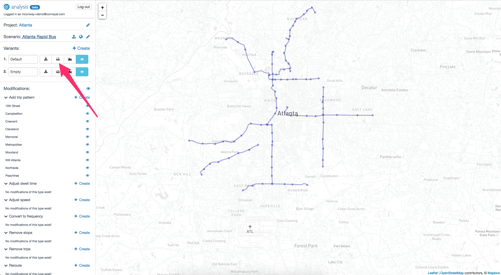
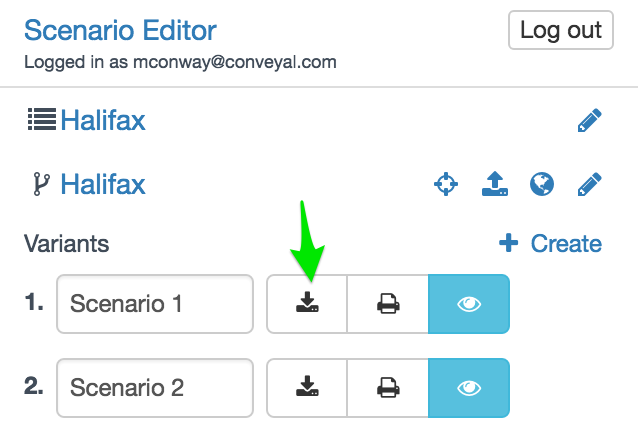

# Exporting modifications

You can generate a report summarizing all of the modifications you have made to a network, for printing or reference. To access the report, click <i class="fa fa-print" style="color:blue"></i> Print report next to the name of a project, then you will be able to choose which scenario to export. Keep in mind that some browsers may not print more than 30 pages or so of a very long report.

<figure>
  
  <figcaption>Generating a report on a scenario</figcaption>
</figure>

<figure>
  
  <figcaption>A report for a scenario</figcaption>
</figure>

Scenarios can also be exported as a .json file by clicking <i class="fa fa-download" style="color:blue"></i> Download.

