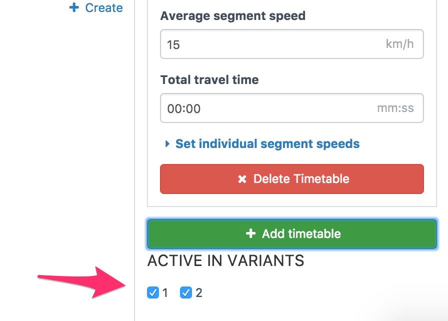
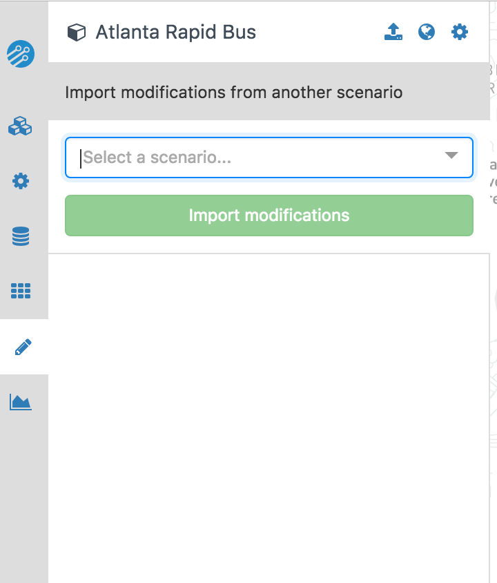

# Overview of editing mode

In Conveyal Analysis, various *modifications* to transit service in the baseline network can be created and grouped into *scenarios*. After logging in and selecting a project, you will arrive at the screen below, which has a numbered list of scenarios and a list of modifications grouped by modification type.

<figure>
  
  <figcaption>Initial view in editing mode</figcaption>
</figure>

A transport scenario is made up of many modifications, each of which represents a single operation on the baseline transit network (for example adding a line, or adjusting the speed of an existing line). You can create a modification by clicking <i class="fa fa-plus"></i> Create a modification.  After you select the modification type and enter a name, you will be taken to a detail panel that varies by [modification type](modifications.html).

By default, each modification will be active in all scenarios that exist when the modification is created.  You can change which scenarios a modification is active in by using the checkboxes corresponding to scenario numbers at the bottom of the detail panel.  

<figure>
  
  <figcaption>Choosing the variants a modification is active in</figcaption>
</figure>

In the list of modifications back on the initial view in editing mode, <i class="fa fa-eye"></i>Toggle map display controls whether each modification is displayed on the map. Clicking the title of a modification will open it and allow you to edit it.

Projects start with only a Default scenario (plus a locked Baseline in which no modifications can be active) You can create additional scenarios by clicking <i class="fa fa-plus"></i> Create and entering a name. The buttons at the right of the list of scenarios allow deleting them, renaming them, and showing or hiding their constituent modifications on the map.

## Importing modifications from another project

Occasionally, you may want to copy all of the modifications from one project into another. This may be useful to make a copy of a project, or to combine modifications developed by different team members into a single project (for instance, one team member working on rail changes and another on bus changes).
To do this, click <i class="fa fa-download"></i>Import modifications from another project.

You can then choose the project from which to import modifications. Only projects which use the same GTFS bundle will be available. All modifications will be imported; when there are multiple scenarios, the scenarios in the project being imported will be mapped directly to the scenarios in the receiving project (i.e. modifications in the first scenario will remain in the first scenario in the new project).

<figure>
  
  <figcaption>Importing modifications from another scenario</figcaption>
</figure>

## Importing modifications from Shapefiles

In general, it is best to create all modifications directly in this editing tool as it allows full control over all aspects of transit network design. However, on occasion, it may be desirable to import modifications from a GIS Shapefile. If you have a Shapefile containing lines, you can upload it to Conveyal Analysis and have it turned into a set of Add Trips modifications. You first need to zip the components of the Shapefile, then you can select <i class="fa fa-globe"></i> Import route alignment shapefile.

Once you have entered the Import Shapefile view and selected a zipped Shapefile, you will see the following.

<figure>
  
  <figcaption>Importing modifications from a Shapefile</figcaption>
</figure>

There are several fields that must be filled in, corresponding to attributes (columns) in the Shapefile:
- Name of each modification (e.g. route id).
- Speed (in km/h)
- Headway (in minutes)

Finally, since Shapefiles only contain the route geometry and not the stop locations, stops can be created automatically. The stop spacing should be specified. The generated stop positions may be individually edited after import, for example to place a stop at a major transfer point.
