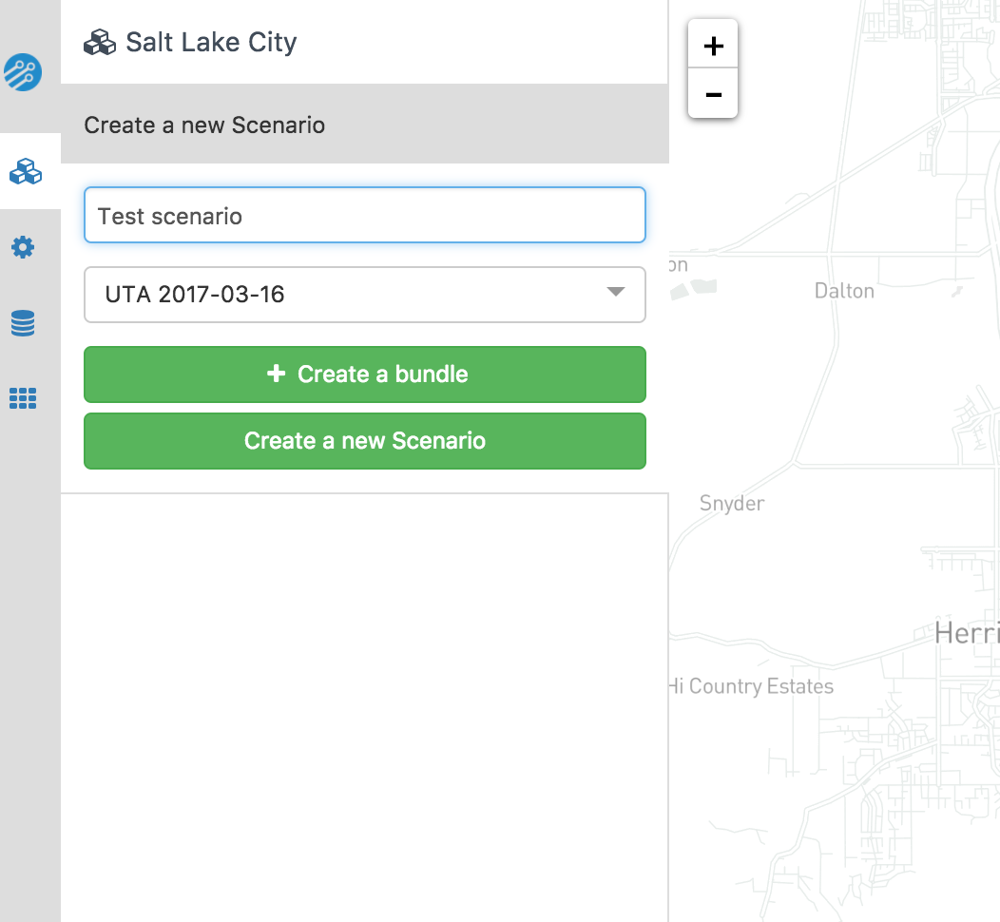

# Overview of network editing

After selecting a :term:`project`, you will arrive at the modifications page, shown below. Each project has an expandable list of numbered :term:`scenarios<scenario>` followed by a list of :term:`modifications<modification>` grouped by type. Each modification represents a single operation on the :term:`baseline network` (for example adding a line, or adjusting the speed of an existing line) and can be activated in multiple scenarios. Scenarios are a way of packaging isolated modifications into meaningful groups representing changes to the broader network. For example, you could create a scenario representing each of several funding scenarios with one for service cuts, one for extended service and so on.

<figure>
  
  <figcaption>Initial view in editing mode for an established project</figcaption>
</figure>

To prevent data conflicts, the system does not support multiple users or browser tabs editing the same project simultaneously. If you expect multiple people in your organization to be using Conveyal Analysis at the same time, you may want to create projects for each of them. Modifications can later be imported into a project from other projects based on the same :term:`network bundle` (See :ref:`managing_mods`).

## Create a new modification

To add a modification, first navigate to the modification page (the <i class="fa fa-pencil"></i> icon). If your project is already selected you should see the following button below the project name. Otherwise you will be prompted to first create or select a project. 

<i class="fa fa-plus"></i> Create a modification

Clicking on this will open a window prompting you to enter a name for the modification and to select a [modification type](modifications.html). 

<figure>
  
  <figcaption>Window with options for creating a new modification</figcaption>
</figure>

Try to choose a descriptive name that will be unique to the chosen modification type. After clicking *create* you will be taken to a page with options specific to your chosen modification type.
Once created, all modifications can be renamed, copied, deleted, or located on the map using the icons at the top left of the screen.
 <i class="fa fa-pencil"></i>Rename
 <i class="fa fa-copy"></i>Copy
 <i class="fa fa-trash"></i>Delete
 <i class="fa fa-square"></i>Fit map to modification extents

The _copy_ command creates a full copy of the current modification which can be found and edited by navigating back to the modification menu.
Any changes you make to a modification are automatically saved every 10 seconds. Clicking the small blue back arrow 
 <i class="fa fa-chevron-left"></i>Modifications  
will also save any remaining edits and take you back to the list of all modifications.

## Create a new scenario

From the modifications page, you can also create and edit :term:`scenarios<scenario>`. A scenario is used for packaging modifications into meaningful groups representing broader changes to the network.
You may need to click the scenarios bar to expand it. Once expanded, you should see the baseline scenario and any others that you have created. Click the button to create a new scenario and give it a name e.g. "_Expanded BRT_" or "_Downtown Stop Consolidation_".
When editing modifications, you may opt to add them to one or more scenarios. The _baseline scenario_ represents the :term:`baseline network` and cannot be edited.

## Activate a modification in a scenario

By default, each modification is active in all scenarios that exist when the modification is created. You can change which scenarios a modification is active in by using the checkboxes corresponding to scenarios at the bottom of the modification detail panel.

<figure>
  
  <figcaption>Choosing the scenarios in which a modification is active</figcaption>
</figure>
