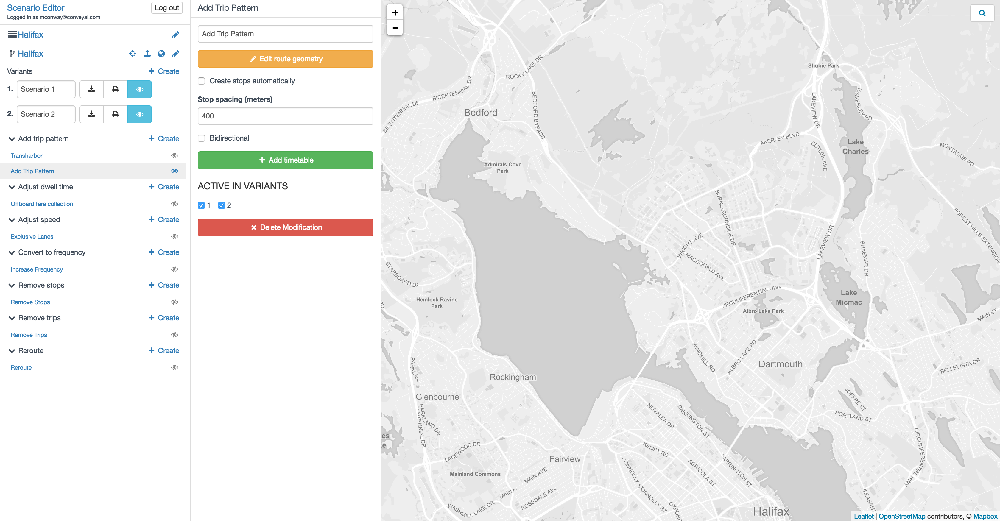
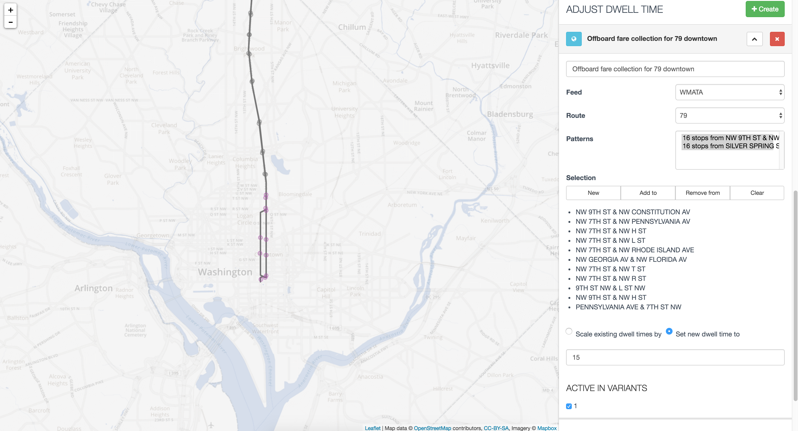
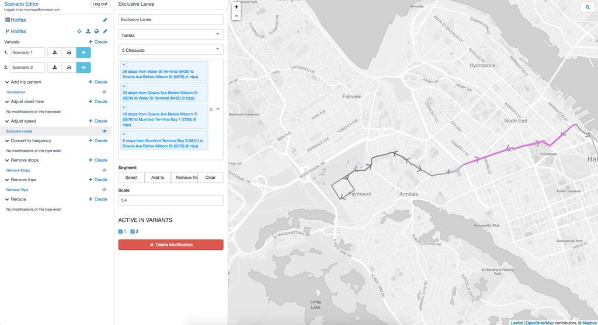
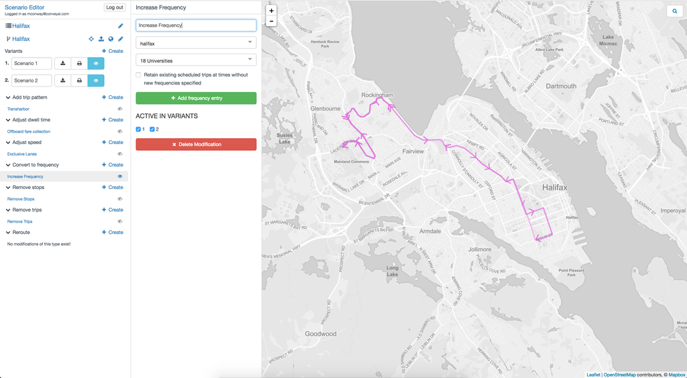
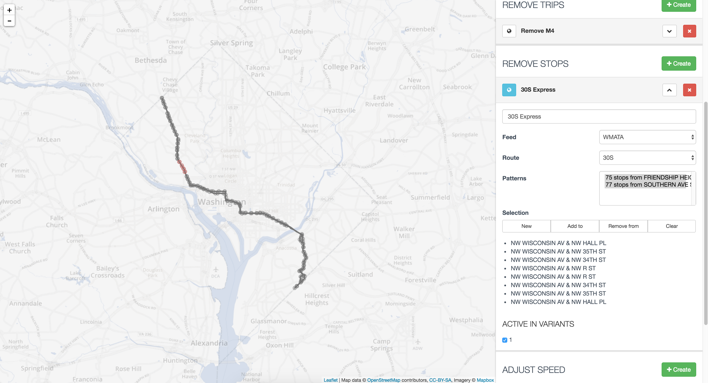
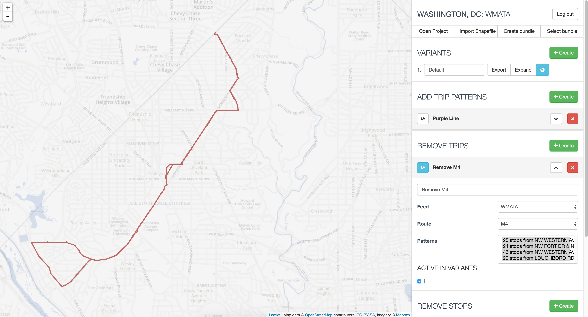
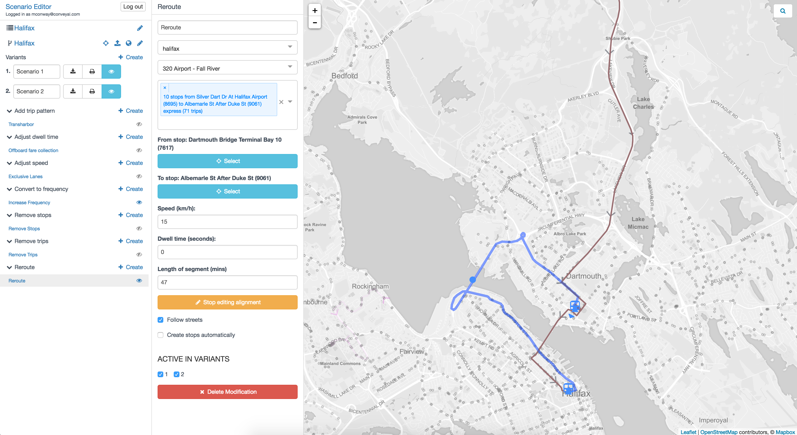

# Modification types

When creating a new modification, you have several different options, each explained in detail below. 

* `Add trip pattern`_
* `Adjust Dwell Time`_
* `Adjust Speed`_
* `Convert to Frequency`_
* `Remove Stops`_
* `Remove Trips`_
* `Reroute`_
* `Custom`_ (not for general use)

Across all modification types the basic actions are consistent. 
 <i class="fa fa-pencil"></i>Rename
 <i class="fa fa-copy"></i>Copy
 <i class="fa fa-trash"></i>Delete
 <i class="fa fa-square"></i>Fit map to modification extents

The _copy_ command automatically creates a copy of the current modification with `(copy)` appended to the name. This copy can be found in the modification menu.
The copy feature is useful for creating modifications that share common elements like adding a route with branches off a main trunk. 
 
Clicking the small blue back arrow saves your changes and takes you back to the list of all modifications:
 <i class="fa fa-chevron-left"></i>Modifications
 Changes are also automatically saved every 10 seconds.

.. _add_trip_pattern:
## Add trip pattern

The **add trip pattern** modification allows you to add new :term:`trip patterns<trip pattern>` to your transport scenario. A trip pattern is a set of stops visited in order by a transit vehicle. Often a route will consist of multiple trip patterns, e.g. one for each direction of travel. This modification also offers a bidirectional option to allow a single trip pattern to represent travel in both directions. This may be easier for modes with generally bidirection stations like subways, ferries, or cable cars. 

After creating a new modification you will see something like the view below.

<figure>
  
  <figcaption>Initial view of an add trip patterns modification</figcaption>
</figure>

You can set the mode (e.g. bus) and add a description for the modification at the top of the panel. To create an alignment, or to edit the alignment you've previously created, click

<i class="fa fa-pencil"></i> Edit route geometry

This will activate the map-based route editing mode. You can stop and save your work at any time with:

<i class="fa fa-stop-circle"></i> Stop editing

New route alignments are defined by by an ordered set of stops and control points. The actual route taken between these can either follow existing streets or it can take a straight line between points. It is also possible to combine the two options in one route as when a bus runs on the street but then diverts into a planned busway which is not yet part of the street network. The distance between stops is used to estimate segment travel time on the new alignment so it is important to as be as accurate with the alignment as possible. 

<figure>
  
  <figcaption>Map symbols for stops and control points</figcaption>
</figure>

By default when you begin editing a new route, you can click once on the map to place the first stop, then again to place the second stop, and so on. If you click on an existing stop (indicated by a small gray circle), the icon for the new stop will be black and the new transit service will stop at that existing stop. If you click in a place where there is not an existing stop, a new stop (in blue) will be created.

Once created, any stop or control point can be moved by dragging it to a new location. Clicking on a stop gives you the option to delete it, or convert it to a *control point* through which the route will pass without stopping. Similarly, control points can be converted back to stops or deleted by clicking on them.

<figure>
  
  <figcaption>Clicking on a stop or control point brings up options to convert or delete it.</figcaption>
</figure>

You can also insert a stop into the middle of an existing alignment. Simply hover over the any part of the line and you should see a new stop appear below your cursor. Click to add it at that location.

On the panel to the left of the map there are a few options available while editing an alignment. These are described below. 

<figure>
  
  <figcaption>Alignment editing options and their default values</figcaption>
</figure>

- **Auto-create stops at set spacing**: Specifies whether stops should be created automatically at a specified interval along the route. When using this option, you will likely want to define your route alignment with control points rather than stops, however if stops are used new stops will not be added unless the gap between existing stops is sufficiently large. The stop spacing can easily be changed later.

- **Bidirectional**: If this option is checked (the default value), vehicles will travel in both directions along the described geometry. If it is toggled off, vehicles will only travel in the direction the line is drawn. Directed alignments can be useful when there are [couplets](https://en.wikipedia.org/wiki/One-way_pair) or other aspects of the route that don't follow the same alignment in both directions. Directed alignments are also necessary for [phasing](phasing.html). 

- **Follow streets**: 
If this option is unchecked (the default value), stops and control points will be connected by straight lines. If it is checked, the route will follow streets. This setting only applies to segments that are actively being edited and will not cause already drawn segments to follow the streets, allowing you to draw part of a route on street and part off-street. The length of each segment is used to estimate travel times between stops, so this feature is very useful for aproximating the length of bus/streetcar routes.

- **Extend**: If this option is checked (the default), clicking on the map will extend the route forward from the end by adding a new stop in the direction the line was drawn. If you wish to edit segments you already created, by adding stops or control points, it is often convenient to uncheck this option so that stray clicks do not extend the route from one of its termini.

- **Extend from end**: When *Extend* is enabled, this option allows you to specify whether new stops will be added moving forward from the last stop of the route (the default) or backward from the first stop of the route. When this option is *un*ticked, new stops will be added as extensions backwards from the beginning.

- **Snap to existing stops (beta)**: Experimental feature that adds stops from the baseline GTFS bundle to the new route. This feature adds stops within 20 meters of the alignment, but not more than one stop approximately every 80 meters.

Once you have created an alignment, you'll need to specify when the route runs using a [simplified timetable](timetable.html). You can do this by [copying a previously created timetable](timetable.html#copying-timetables), or by clicking:

<i class="fa fa-plus"></i> Add timetable

.. _adjust_dwell_time:
## Adjust dwell time

You may also want to adjust the dwell time along a route or at a particular stop, for example to model the effects of off-board fare collection, or the effects of increasing ridership at a particular stop. As with the remove-stops modification, you can select a feed, route and optionally patterns. You can then use the map to select the affected stops (if you skip this step, all stops will have their dwell times adjusted). You can then choose to either enter a new dwell time (in seconds), or scale the existing dwell times (for instance, entering 2 would double existing dwell times).

Unfortunately, the stop_times.txt files of many GTFS feeds use equal arrival_time and departure_time values. For such feeds that do not represent dwell time explicitly, this modification type may not be immediately applicable.

<figure>
  
</figure>

.. _adjust_speed:
## Adjust speed

This modification can be applied to multiple routes, but only one route will be shown on the map.

This modification does not automatically increase frequency in response to the more efficient routes. However, it can be paired with an adjust frequency modification to model such a response.

Sometimes you will want to adjust the speed on an entire route or just a :term:`segment` of one. For instance you might want to model the addition of bus lanes or an application of transit signal priority. This modification allows you to scale the speed of existing scheduled :term:`trips<trip>`, or segments of them, by a constant factor. It can be applied to whole routes (in which case more than one route may be selected) or to selected segments of a particular route or to just a subset of :term:`trip patterns<trip pattern>`. 

You will need to select a GTFS feed, routes and optionally :term:`trip patterns<trip pattern>` if only one route is selected. All trip patterns will be selected by default. Segments can be selected by clicking _Select_ from the toolbox shown in the figure below. This will allow you to begin drawing a polygon selection area on the map. Any segments within this area will be selected when the polygon is closed and selected segments will then render on the map in purple. 

<figure>
  
  <figcaption>Options for selecting segments of trip patterns</figcaption>
</figure>

The _Select_ option will begin a new selection and the _Add to_ option will add to the current selection if any. _Remove from_ allows you to select segments to remove from the current selection and _Clear_ un-selects all segments. 

<figure>
  
  <figcaption>Segments are selected from two overlapping trip patterns</figcaption>
</figure>

Finally, enter a numeric value in the _Scale speed by_ field --- this is the factor to multiply the speed by. For instance, if you enter 1.3, the speed of vehicles will increase by 30% when traveling between stops. Note however that this modification does not affect dwell times; to model changes in dwell time, see the :ref:`adjust_dwell_time` modification. It also does not take into account the possibility of increased frequency due to faster, more efficient routes. However, it can be paired with a :ref:`convert_to_frequency` modification to model that scenario.

.. _convert_to_frequency:
## Convert to frequency

Often a scenario will include changes to the number of trips per hour on an existing route. We support this using the _convert to frequency_ modification. It works by replacing the scheduled trips for one or more existing :term:`trip patterns<trip pattern>` with frequency based :ref:`timetables`. You can opt either to 
* delete all existing trips and replace them with your own timetables or 
* replace trips only when the new timetables would be in effect. 

The travel and dwell times on the replacement trips are based on those of an existing trip which you can select from the affected trip pattern. The new timetables can make use of :ref:`phasing` to reproduce timed services on branching lines, etc. 

First, create a new modification and select _Convert to frequency_. Give the modification a name; you will likely want to name it after the route you plan to modify.

<figure>
  
  <figcaption>A convert to frequency modification with a replacement timetable open</figcaption>
</figure>

Start by selecting a :term:`GTFS feed` and then the route from that feed that you want to adjust. You should see all trip patterns for the selected route displayed on the map. 

You can choose to remove all existing trips on the route (the default) and start from scratch with new timetables. Or you may choose to retain trips outside the time windows in which you specify frequencies which is useful when you are changing the frequency for only part of the day (e.g. increased weekend frequency) and want to retain the existing scheduled service at other times. This is controlled using the checkbox labeled "_Retain existing scheduled trips at times without new frequencies specified_". 

You then create any number of frequency entries using simple [timetables](timetable.html).
Within each timetable, you will need to select a trip pattern from your route, then a particular trip from that trip pattern to be used as a template. Travel times for the new timetable will be based on this template trip so it is important to choose one that is representative. For example, you may want to select one of the slower trips when specifying frequencies during congested peak-hour service. 

<figure>
  
  <figcaption>A convert to frequency modification with a replacement timetable open</figcaption>
</figure>

Typically, you will need to create _at least_ two new timetables, one for each direction of travel. 

.. note:: 
    Once converted to a frequency-based route with this modification, any of a route's patterns not represented by a timetable are effectively removed. With "retain trips" set to the default value of false (unchecked), these patterns will be removed at all times of day. With "retain trips" set to true (checked), they will be removed when any frequency entry is active.

.. _remove_stops:
## Remove stops

It is also possible to remove some of the stops from a route, while leaving the rest of the route untouched. To do this, create a new _remove stops_ modification, and select a feed, route, and patterns as you did when removing trips. You can then use the map to select which stops to remove. Under "Selection," click "new", "add to," or "remove from" to select new stops to remove, add to the existing selection, or remove from the existing selection. Stops that are selected for removal are listed at the bottom of the modification, as well as being highlighted in red on the map.

You can also specify that you wish to remove a certain amount of time at each removed stop (in addition to the dwell time specified in the original feed, which is automatically removed). This could be used to account for acceleration and deceleration, and can also be used when the original feed does not specify dwell time. This feature is useful when testing the effects of stop consolidation.

When removing the beginning of a route, the dwell times at each stop are removed, as is any time specified to be removed at each removed stop. Any remaining travel time is preserved as an offset from the start of the trip in the original GTFS to the start of trips at the new first stop. This is effectively as if the vehicles were leaving the original terminal at the same time but deadheading past all of the removed stops.

This modification does not take into account the possibility of increased frequency due to more efficient routes. However, it can be paired with a :ref:`convert_to_frequency` modification to model that scenario.

<figure>
  
</figure>

## Remove trips

Another common modification is to remove trips. The most common use is to remove entire routes, but it is also possible to remove only specific :term:`trip patterns<trip pattern>` on a particular route. In order to remove trips, create a new _remove trips_ modification, and select a GTFS feed, route, and optionally the trip pattern of the trips to be removed. All trips on this route/pattern combination will be removed and the route will be shown in red on the map. Note that the "active in variants" selector always specifies whether the modification is active. In this case it implies that the trips will be removed from the selected variants.

<figure>
  
</figure>

.. _reroute:
## Reroute

This modification type can be used to represent detours, extensions,and curtailments. When creating a _reroute_ modification, you first select a :term:`GTFS feed`, route, and :term:`trip patterns<trip pattern>`. Once trip patterns are selected, you then select a stop at which the reroute alignment will start, or a stop at which the reroute alignment will end, or both, by clicking
 <i class="fa fa-crosshairs"></i> Select
  then clicking an existing stop on the baseline pattern.

<figure>
  
  <figcaption>A trip pattern being extended from a selected stop at the end of the line.</figcaption>
</figure>

Once a start or end stop is specified, you can add and modify segments by clicking the *Edit route geometry* button, then clicking on the map. Editing behavior is similar to editing mode for [adding trip patterns](#add-trip-pattern) though with some options fixed depending on whether the route is being extended in either direction, or if the reroute is happening in the middle of the alignment. 

- If only the "start of reroute/extension" is set, new stops and segments will be added extending _forward_ from the selected stop on the baseline pattern ("Extend from end" turned on).
- If only the "end of reroute/extension" is set, new stops and segments will be added extending _backward_ from the selected stop on the baseline pattern ("Extend from end" turned off).
- If both are set, the new segment between the stops cannot be extended, but it can be modified by clicking on it to add stops and control points ("Extend" turned off).

A reroute modification can apply to multiple trip patterns in a single direction as long as the patterns all contain the start and end stop in order; you will generally need to create one reroute modification for each direction of the route.

A few examples should help to illustrate how this modification works. Consider a baseline pattern passing through stops A -> B -> C -> D:

- To curtail this pattern at stop C, eliminating service to stop D, select C as the "start of reroute/extension."
- To reroute this pattern from C to another stop X instead of D, select C as the "start of reroute/extension," activate route editing, and click on stop X to add a segment from C -> X. Speeds and dwell times can be set on this added segment. Baseline speeds and dwell times between A and C are not affected.
- To extend this pattern backward, to originate at a stop Y, select A as the "end of reroute/extension," activate route editing, and click on stop Y to add a segment from Y -> A. Speeds and dwell times can be set on this new segment. Baseline speeds and dwell times between A and D are not affected.
- To detour this pattern so that it serves a stop Z between B and C, select B as the "start of reroute/extension", select C as the "end of reroute/extension", activate route editing, click on the new segment to add a stop, and drag the added stop to Z. Speeds and dwell times can be set on this new segment. Baseline speeds and dwell times between A and B, and between C and D, are not affected.

.. _custom:
## Custom modifications

The custom modification type allows us to try out new development features that are not yet generally supported. _You should not use this modification type without consulting with your support team; an improper configuration may produce errors during analysis._ 
