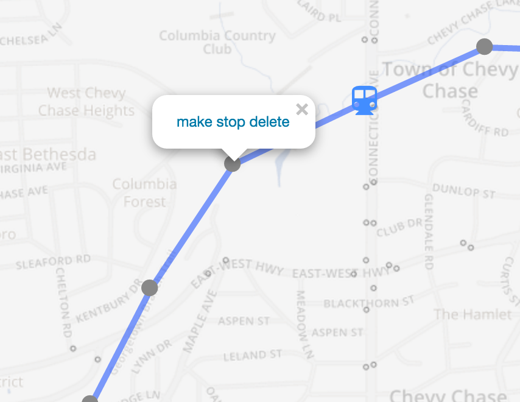

# Modification details

At the top of the modification details panel, there are multiple actions for each modification, including:
 <i class="fa fa-pencil"></i>Rename
 <i class="fa fa-copy"></i>Copy
 <i class="fa fa-trash"></i>Delete

Clicking the small blue back arrow (<i class="fa fa-chevron-left"></i>Modifications) saves your changes and take you back to the list of all modifications.  Changes are also automatically saved every 10 seconds.  Each type of modification has additional options available, as detailed below.

## Add trips

The add trips modification allows you to add new [trip patterns](../glossary.html#trip-pattern) to your transport scenario. Generally
one add-trip modification is used to model a new route, adding all of the trip patterns on that route. After creating the modification you will see this view:

<figure>

</figure>

To create an alignment for the modification (or to edit the alignment you've previously created), click
 <i class="fa fa-pencil"></i> Edit route geometry

This will activate editing mode.  In editing mode, click once on the map to place the first stop, then again to place the second stop, and so on. If you click on an existing stop (indicated by a small gray circle), the icon for the new stop will be black and the new transit service will stop at that existing stop. If you click in a place where there is not an existing stop, a new stop (in blue) will be created.  

To insert a stop into the middle of an alignment, click any part of the alignment.  Once created, any stop can be dragged to move it.  Clicking on a stop gives you the option to delete it, or convert it to a _control point_ through which the route will pass without stopping. Similarly, control points can be converted back to stops or deleted by clicking on them.  It's important to get the alignment approximately correct so that the length of each segment is correct when used to calculate the travel times between stops.
<figure>

</figure>

Available options while editing an alignment include:
* **Auto-create stops**: Whether stops should be created automatically at a specified interval along the route.
* **Bidirectional**: If this checkbox is checked, vehicles will travel in both directions along the described geometry. If it is left unchecked, vehicles will only travel in the direction the line is drawn (which can be useful when there are couplets or other aspects of the route that don't follow the same alignment in both directions). You can choose whether stops should be created automatically at a specified interval along the route, or if you will create all stops manually.
* **Follow streets**: Make the route follow the streets. This only applies to segments that are actively being edited, and will not cause already drawn segments to follow the streets, allowing you to draw part of a route on street and part off-street.

Once you have created an alignment, you need to specify when the routes run using a [simplified timetable](timetable.html). You can do this by [copying a previously created timetable](timetable.html#copying-timetables), or by clicking:
 <i class="fa fa-plus"></i> Add timetable

## Adjust dwell time
You may also want to adjust the dwell time along a route or at a particular stop, for example to model the effects of off-board fare collection, or the effects of increasing ridership at a particular
stop. As with the remove-stops modification, you can select a feed, route and optionally patterns. You can then use the map to select the affected stops (if you skip this step, all stops will have their
dwell times adjusted). You can then choose to either enter a new dwell time (in seconds), or scale the existing dwell times (for instance, entering 2 would double exiting dwell times).

Unfortunately, many source GTFS feeds do not contain any dwell time, meaning that this modification is of limited usefulness in some cases.

<figure>

</figure>

## Adjust frequency

Often a scenario will include frequency changes to existing lines. We support this using the adjust frequency/convert to frequency modification. First, create a "convert to frequency" modification, and choose the feed and route you want to adjust:

<figure>

</figure>

You then create any number of frequency entries using [simple timetables](timetable.html). Typically, there will be at least two entries (one for each direction). Each frequency entry will follow one template trip, which determines the stop-to-stop travel times of the trips that are created with the given frequency.

You then [add details to each frequency entry](timetable.html). Repeat this process until you have created frequency entries for all the service you want to retain, in both directions.

You can choose to remove all existing trips on the route (the default) or choose to retain trips outside the time windows in which you specify frequencies, which is useful when you are changing the frequency for only part of the day (e.g. increased weekend frequency) and want to retain the existing scheduled service at other times. This is controlled using the "Retain existing scheduled trips at times without new frequencies specified" checkbox.

## Adjust speed

Sometimes you will want to adjust the speed on a route, or a portion of it (for instance due to the addition of dedicated bus lanes, or an application of transit signal priority).
As before, you will create the modification and select a feed, routes and patterns. If you want to modify only part of the route, you can use similar selection tools to those used in the
remove stops (with new selection, add and remove buttons). The difference is that you are now selecting [hops](../glossary.html#hops). The selected segment will be shown on the map in purple.
Finally, enter a scale, which is the factor to multiply the speed by. For instance, if you enter 2, vehicles will travel twice as fast between stops (this modification does not affect dwell times;
to model changes in dwell time, see the adjust dwell time modification below).

This modification does not take into account the possibility of increased frequency due to more efficient
routes. However, it can be paired with a change frequency modification to model that scenario.

<figure>

</figure>

## Remove stops

It is also possible to remove some of the stops from a route, while leaving the rest of the route untouched. To do this, create a new Remove Stops modification, and select a feed, route, and
patterns as you did when removing trips. You can then use the map to select which stops to remove. Under "Selection," click "new", "add to," or "remove from" to select new stops to remove, add to
the existing selection, or remove from the existing selection. Stops that are selected for removal are listed at the bottom of the modification, as well as being highlighted in red on the map.

You can also specify that you wish to remove a certain amount of time at each removed stop (in addition to the dwell time specified in the original feed, which is automatically removed). This could be used to account
for acceleration and deceleration, and can also be used when the original feed does not specify dwell time.
This feature is useful when testing the effects of stop consolidation.

When removing the beginning of a route, the dwell times at each stop are removed, as is any time
specified to be removed at each removed stop. Any remaining travel time is preserved as an offset
from the start of the trip in the original GTFS to the start of trips at the new first stop. This is
effectively as if the vehicles were leaving the original terminal at the same time but deadheading
past all of the removed stops.

This modification does not take into account the possibility of increased frequency due to more efficient
routes. However, it can be paired with a change frequency modification to model that scenario.

<figure>

</figure>

## Remove trips

Another common modification is to remove trips. The most common use is to remove entire routes, but it is also possible to remove only specific patterns on a particular routes.
In order to remove trips, create a new Remove Trips modification, and select a GTFS feed, route, and optionally the trip pattern of the trips to be removed. All trips on this
route/pattern combination will be removed, and the route will be shown in red on the map. Note that the "active in variants" selector always specifies whether the modification is active,
so in this case implies that the trips will be removed from the selected variants.

<figure>

</figure>

## Reroute

It is also possible to add stops to a route (i.e. reroute the route). You can do this at the beginning or end of a route, or have a reroute in the middle.
First, create a Reroute modification, and select a route and patterns (as before). You then select the start and end stop of the reroute (i.e. where the route begins
and ends its deviation from the its existing pattern). Note that you will need to select patterns appropriately and create one reroute for each direction of the route;
a reroute can apply to multiple patterns in a single direction as long as they both contain the start and end stop in order. You select a stop by clicking the select stop
button, and then choosing the stop on the map. If you leave the from stop blank, the entire route up to the from stop will be rerouted. If you leave the to stop blank, the entire route
after that point will be rerouted. This can be used to extend routes, or to divert the ends of routes (e.g. to new rail stations).

<figure>

</figure>

You can then edit the alignment and the intermediate stops by clicking
 <i class="fa fa-pencil"></i> Edit route geometry

This activates editing mode, which is explained above for [adding trip patterns](#add-trips).

This modification is displayed on the map with the route being modified in gray, any segments that are being replaced in red, and the new segments in blue.
