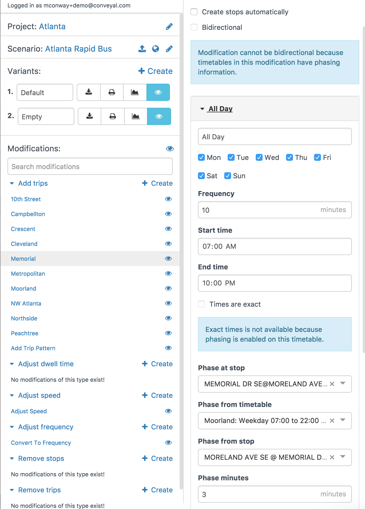

.. _phasing:
# Phasing

The phasing feature can be used to tie the timetables of two :ref:`add_trip_pattern` or :ref:`convert_to_frequency` modifications together. For example, if you are creating a [pulsed system](http://humantransit.org/2010/11/basics-finding-your-pulse.html) where buses run infrequently but are timed to meet at specific transfer points, you might want to specify that while you don't know the exact schedules of any of the lines, they will all meet at a central point at the same time. Alternately, you might have a [branching service](http://humantransit.org/2011/02/basics-branching-or-how-transit-is-like-a-river.html) where two lines share part of their alignment but then branch. If each branch runs every 30 minutes, you might want to write the schedules such that they provide service every 15 minutes on the shared alignment, rather than both coming at the same time.

You can accomplish both of these things using the phasing settings. We implement this by allowing you to lock the departures on one timetable or frequency entry to those of another, saying that vehicles on one frequency entry depart a stop a certain number of minutes after vehicles on another frequency entry (generally on a different modification) depart a stop (the same one or a different, nearby one).

The image below shows the settings for a pulse between two lines in Atlanta. 

<figure>
  
  <figcaption>Phasing fields</figcaption>
</figure>

This line on Memorial Drive is phased at the stop "Memorial Drive SE at Moreland Ave SE" from the stop "Moreland Ave SE at Memorial Drive SE" on the timetable "Weekday" in the "Moreland" modification, with a phase of three minutes. This means that vehicles running on this timetable (7 AM-10 PM every day) will depart the stop "Memorial Drive SE" will depart "Memorial Drive SE at Moreland Ave SE" three minutes after vehicles on the "Weekday" timetable of the Moreland route depart the stop "Memorial Drive SE at Moreland Ave SE."

First, you select one of the stops on this line to phase at (the "phase at stop"). You then can select a modification (either an Add Trips modification or an Adjust Frequency modification) and frequency entry or timetable to phase from (the "phase from timetable"); the dropdown shows the name of the modification, as well as the name of the frequency entry and details about it. You can then choose the stop on the other modification where the phase should be applied (the "phase from stop").

Finally, you can specify the phase in minutes, which is how long after the other vehicle departs that this one should depart (at the last stop on either modification, the arrival time will be used in lieu of the departure time).

If you wish to create a pulse, generally you would want to specify a dwell time at the stop as well, to accommodate bidirectional transfers. Adjust frequency modifications may be paired with an [adjust dwell time](modifications.html#adjust-dwell-time) modification to accommodate this. There is not currently a way to set the dwell time at a specific stop in an add trips modification, but this feature is on the short-term development roadmap. The analysis engine requires at least a minute between alighting from one vehicle and boarding the next to make a connection, plus any walking time if the boarding and alighting do not occur at the same stop.

Pulsing will be disabled if either of the modifications involved is bidirectional (because we won't know how to properly phase the directions together), or if either of the frequency entries involved are specified using "exact times" (because the times are already set and can't be adjusted to match the other entry). It is possible to phase two frequency entries which do not have the same headway, although this should
be used with caution. If one headway is a factor of the other, they will just be lined up so that they occur together when possible (for instance, vehicles on frequency entries with headways of 15 minutes and 30 minutes set up to pulse will arrive together every 30 minutes, with an additional trip from the 15 minute headway occurring in between). However, if they are not factors of each other, the results will not be as desired. For instance, phasing frequency entries with headways of 15 and 20 minutes will result in trips being aligned as desired once per hour, with other trips misaligned (for example, vehicles on the frequency entry with 20-minute headway might arrive at 7:00, 7:20, 7:40 and 8:00, while vehicles on the frequency entry with 15-minute headway might arrive at 7:00, 7:15, 7:30, 7:45 and 8:00).
