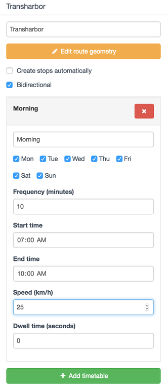

# Timetables

Add trip and convert to frequency modifications require simple timetables.  By default, a newly added timetable or frequency entry will specify trips running every 10 minutes from 7 AM to 10 PM, every day of the week.

<figure>
  
  <figcaption>Newly added timetable</figcaption>
</figure>

Each timetable or frequency entry allows for the specification of days of service, span of service, and frequency. You can add as many timetables as you need to specify different frequencies or speeds at different times of days.  Overlapping windows can be specified, but keep in mind that this means that trips on _both_ entries will operate at the specified frequencies (e.g., if you have a ten-minute frequency and a 15-minute frequency overlapping, there will be one set of vehicles coming every ten minutes, and another, independent, set coming every 15).

For add trip modifications, speed and dwell time values can be set for each timetable, either at the segment level or as overall average values.  

For convert to frequency modifications, speed and dwell time values are copied from the template trip. Oftentimes, travel time will vary throughout the day due to varying traffic and passenger loads, so it makes sense to choose a template trip that is representative of the time window for which you are creating frequency service.

## Exact Times

You can specify whether the timetable represents an assumed headway, or represents the exact schedule, using the "Times are exact" checkbox. The default setting, with this box unchecked, should be used when a trip pattern's frequency is known but an exact schedule has not yet been defined (e.g. for a new service still in the planning stages).  For example, consider an entry specifying that a particular pattern runs every 15 minutes from 9 AM until 7 PM. With the checkbox unchecked, the routing engine knows that vehicles depart the first stop on the route every 15 minutes between 9 AM and 7 PM, but has no information as to exactly when that will happen. For example, vehicles might leave at 9:02, 9:17, 9:32, and so on, or they might leave at 9:10, 9:25, 9:40, etc.; many of these possibilities will be simulated in order to get a complete picture of how different possible schedules might perform. See [methodology](../analysis/methodology.html) for more details.

When the complete schedule is defined, it is appropriate to activate the "Times are exact" checkbox. In this case, a single schedule will be created, with the first departure at the start time, and then additional departures with exactly the specified frequency until (but not including) the end time. For example, in the scenario given above, the vehicles would be scheduled to depart at exactly 9:00, 9:15, 9:30 until 6:45 (not at 7:00 because the end time is not included).  

If the schedule is not known, but it is known that the schedules of two lines will be related (e.g. using timed transfers or pulsed schedules), the [phasing feature](phasing.html) may be enabled.

## Copying Timetables

Timetable entries can be copied between add trip and frequency modifications.

Some users may find it convenient to use a single template add trip modification that specifies commonly used service windows and frequencies.  For example, you could create a "Base Timetables" modification and deactivate it from all scenarios.  You could then add multiple timetables to this template:
* AM Peak, Frequent Network: 7 AM to 9 AM, every 5 minutes, every day
* Midday, Frequent Network: 9 AM to 3 PM, every 10 minutes, every day
* PM Peak, Frequent Network: 3 PM to 6 PM, every 5 minutes, every day
* Base Weekday: 6 AM to 11 PM, every 30 minutes, Monday through Friday
* Base Weekend: 7 AM to 11 PM, every 60 minutes, Saturday and Sunday

When proceeding to add new routes with add trip patterns, the appropriate timetables could then be copied from this template by clicking:
 <i class="fa fa-plus"></i> Copy timetable
