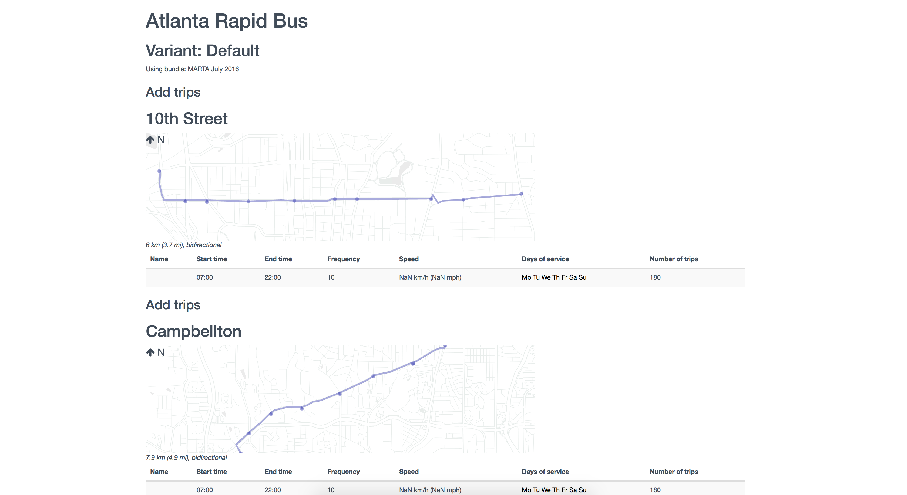

.. _managing_mods:
# Managing modifications

:term:`Modifications<modification>` can be grouped by :term:`project` and :term:`scenario`, and different projects and scenarios can be compared against each other in analysis mode, giving you flexibility on how to use them. Depending on your use cases, different approaches may make sense.

If one user will be responsible for analyses in your region, involving a relatively small number of modifications, we recommend doing your work in one project and assessing the impact of different combinations of modifications by creating and using scenarios within that project.

If multiple users will be involved in editing scenarios, or if you want to assess more than 10 different combinations of modifications, which would make the list of scenarios annoyingly long, we recommend dividing the modifications among different projects. For example, one team member could code rail scenarios in Project A, another team member could code bus scenarios in Project B. Modifications can be [imported](#importing-modifications-from-another-project) between projects that use the same :term:`GTFS bundle`; in this example, modifications from the two projects could combined in a third Project _C_.

.. _toggle_mod_display:
## Toggling display of modifications

In the list of modifications on the initial view in editing mode, clicking the title of a modification will open it and allow you to edit it. To control whether each modification is displayed on the map, click

<i class="fa fa-eye"></i>Toggle map display

Stops and segments representing modifications are displayed on the map, using different colors to indicate their state relative to the baseline GTFS:
* Blue: Added trip pattern
* Red: Removed trip pattern
* Pink: Changed timetable (e.g. modified frequency, speed, or dwell time)
* Gray: Unchanged (alignment is unchanged but the :term:`trip pattern` is effected somehow, e.g. :ref:`reroute`)

Projects start with only a "Default" scenario (plus a locked :term:`Baseline<baseline network>` in which no modifications can be active). You can create additional scenarios expanding the list of scenarios, clicking the create button, and entering a name.

Next to each added scenario are options to:
 <i class="fa fa-trash"></i>Delete the scenario
 <i class="fa fa-pencil"></i>Rename the scenario
 <i class="fa fa-eye"></i>Show on the map the modifications active in the scenario

.. _export_mods:
## Exporting modifications

To see options for exporting scenarios from the top of the editing panel, click
 <i class="fa fa-share-alt-square"></i>Download or share this project

A panel will then be shown with multiple options to download or share the scenarios in your project:

* <i class="fa fa-download"></i> Raw scenario (.json) all scenario details
* <i class="fa fa-download"></i> New alignments (.geojson) alignments of add-trip modifications
* <i class="fa fa-download"></i> New stops (.geojson) new stop locations created in the scenario
* <i class="fa fa-print"></i> Summary Report a summary of all modifications in a scenario, for printing or reference. Keep in mind that some browsers may not print more than 30 pages or so of a long report.

<figure>
	
	<figcaption>A summary report for a scenario</figcaption>
</figure>

.. _import_mods:
## Importing modifications

To import modifications from another project or a shapefile, click
 <i class="fa fa-upload"></i>Upload/import modifications

### From another project

Occasionally, you may want to copy all of the modifications from one project into another. This may be useful to make a copy of a project, or to combine modifications developed by different team members into a single project (for instance, one team member working on rail changes and another on bus changes).

To do so, select a project in the upload/import panel and click
 <i class="fa fa-copy"></i> Import

If you choose a project associated with the same GTFS bundle, all modifications will be imported; when there are multiple scenarios, the scenarios in the project being imported will be mapped directly to the scenarios in the receiving project (i.e. modifications in the first scenario will remain in the first scenario in the new project).

If you choose a project associated with a different GTFS, bundle, only add-trip modifications will be imported.

### From shapefiles

In general, it is best to create all modifications directly in Conveyal Analysis as it allows full control over all aspects of transit network design. However on occasion it may be desirable to import modifications from a [shapefile](https://en.wikipedia.org/wiki/Shapefile). If you have a shapefile containing route geometries, you can upload it to Conveyal Analysis and have it turned into a set of :ref:`add_trip_pattern` modifications. Your shapefile will need attributes for each line's:
* name
* approximate headway in minutes
* approximate speed in kmph

The shapefile should contain only linear features. Points on the lines will be converted into control points in the modification and by default stops will be spaced uniformly along the line. If think you may want to edit the alignment later in Conveyal Analysis, it might be helpful to simplify complex geometries before uploading them. 

To upload a shapefile from the upload/import panel (<i class="fa fa-upload"></i>), click

<i class="fa fa-upload"></i> Import

After selecting and uploading a zipped shapefile, you should see the following options. You'll need to use the dropdown menus to identify the attributes from your uploaded shapefile that will be used to generate the modifications. 

<figure>
  
  <figcaption>Options for importing route alignments from a shapefile</figcaption>
</figure>

Finally, as shapefiles only contain the route geometry and not the stop locations, stops can be created automatically at a specified spacing. Stops may be explicitly added or moved after import.
