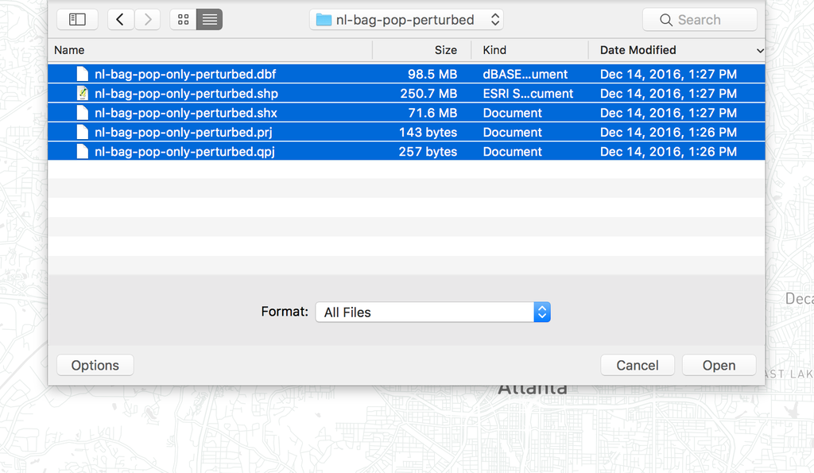

# Preparing opportunity datasets

To measure access to spatially distributed opportunities (e.g. jobs, people, schools), you will need to ensure at least one **opportunity dataset** has been added to your project.  To add or manage opportunity datasets, click this icon on the sidebar:
 <i class="fa fa-th"></i> Opportunity Datasets

## Uploading opportunity datasets

Opportunity datasets can be created by uploading point-based shapefiles, polygon-based shapefiles, or a .csv file of points.  Files must have at least one numeric attribute/column in addition to coordinates/geometries.  For point files, it often makes sense to include a "count" column filled with 1.

To start an upload, click:  <i class="fa fa-plus"></i> Upload a new opportunity dataset

Enter a name for the opportunity dataset source, then select the appropriate files.

If you are uploading a shapefile, it should not be zipped. Select all of the files in the Shapefile when uploading (at the very least, `.shp`, `.shx`, `.dbf` and `.prj`). How you select multiple files depends on your browser and operating system, but generally will involve shift-clicking, control-clicking or command-clicking.

<figure>
  
  <figcaption>Uploading a Shapefile by selecting all constituent files</figcaption>
</figure>

If you upload a CSV file, two extra fields will appear, in which you must type the field names of the latitude and longitude fields (we currently only support CSV files in WGS 84 Latitude/Longitude coordinates).

Once you have done this, click the upload button to start the upload.  Opportunity datasets will be saved with the source name you entered and the attribute/column names of the uploaded files.

## Avoiding common errors
* Eliminate extraneous attributes/columns from your shapefile/csv before uploading.
* Ensure entries are numeric, not text values (e.g. "N/A", numbers stored as text). Only columns with exclusively numeric entries will be saved.

## Managing opportunity datasets

Selecting an existing opportunity dataset from the dropdown menu will give you options to:
* <i class="fa fa-pencil"></i> Edit dataset name
* <i class="fa fa-trash"></i> Delete this dataset
* <i class="fa fa-trash"></i> Delete entire dataset source (e.g. all attributes from a shapefile)

## LODES import

For projects in the United States, Census block-level data on employment and workforce from [LODES](https://lehd.ces.census.gov/data/#lodes) can be fetched by clicking:  <i class="fa fa-group"></i> Fetch LODES
